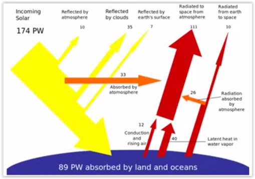

# Week 1 - Lecture 1 - Introduction

* Alternative (and renewable) energy sources are strategic points for economy;
* It's important to reduce carbon dioxide emissions;
* Types of renewable energy:
*
* Wind;
* Solar;
* Tidal;
* Wave;
* Ocean;
* Bio;
* etc;

* The demand of energy is growing after each year;
* Solar energy has 1x10^5 TW at Earth's surface. Technically, it's possible to use 10000 TW, a more promising source than all others;

* Interaction of incoming solar energy with Earth:

* Solar energy comes as photons and we need to turn this in "useful" energy to human consumption;
* There are some different strategies to store solar energy:
*
* **Solar Fuels**:
*
* Convert sun light in some chemistry product, a fuel, similar as petrol or coal treatment today;
* It's very far from being applicable;
* It's used converting water in hydrogen and oxygen (classic electrolysis), and burn products after;
* Other way is direct fixing of carbon dioxide in fuels like methane and methanol;

* **Solar Electricity**:
*
* Solar cells that convert sunlight directly into electricity;

* **Solar Thermal**:
*
* Converts sunlight into heat;
* Most efficient but only generates heat, that has a limited use;
* Conversion from heat to electricity in turbine also has low efficiency;

* Efficiency conversion comparison nowadays: Solar Thermal (~85%) > Solar Electric (10~20%) > Solar Fuel;
* The harvesting problem is a surface problem. The method we choose to extract this needs to cover a large area;
* **Photovoltaics**: Based in photoelectric effect: Observed by F. Hertz in 1887 and explained by A. Einstein in 1905 (Nobel Prize at 1921);

* Requirements for success:
*
* Large surfaces;
* Materials;
* Manufacturing;
* Low energy payback time;
* Low carbon footprint;
* Efficiency;
* Low cost;
* Speed;
