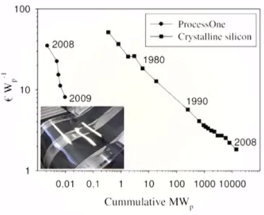

# Week 1 - Lecture 2 - Three Generations of Solar Cells

**A brief historical overview of Solar Cells*** **Historical definition**: Solar cell is a solar device that receive sunlight and convert it in electricity;
* **1950s**, Bell Labs:
*
* Starts with inorganic silicon cells;
* 6% efficiency;
* People start to predict solar systems large applicable in future, like solar houses;

* **1970s**, Energy Crisis:
*
* Helps to indicate the importance of alternative sources of energy development;

* **1st Generation**:
*
* Example: Crystalline Silicon;
* Cells are still too expensive. High material usage, heating up semiconductors with high melting point, refining, etc;
* A boxed semiconductor that's sliced into a thin sheet that can be converted into a solar harvesting device;
* Embodies a lot of energy;
* Stable for a long time without deterioration;
* Not applicable in large scale;

* **2nd Generation**:
*
* Also called as Thin Film solar cells;
* Instead make a bulk material, you could make a thin film on a carrier substrate, that was the cell;
* Example: Amorphous silicon solar cell. Made at much lower temperature (~hundred degrees);
* Solved problems from previous generation like high embodied energy, manufacturing temperature, high materials use;
* Presents inherent problems like usable time, operating with decaying performance (Staebler-Wronski Effect);
* Instability caused by sensitivity to atmosphere gases (water and oxygen);
* Slow development and production for the sake of this instability;
* Other examples: Cadmium Telluride, Copper Indium Gallium Selenide (CIGS), Protocrystaline and Nanocrystaline silicon;
* Hight ecotoxicity of this products is also a environmental problem;

* **3rd Generation: Organic Photovoltaics**
*
* Aim lower costs, efficiency over 10%, thinner films and even lower temperatures of production;
* Nobel Prize in Chemistry in 2000 for A. J. Heeger, Alan MacDiarmid and Hideki Shirakawa;
* A great explosion in number of publications with 3rd Generation per year after 2000 (more than 3500 in 2013) but, curiously, no products in the market;
* The learning curve about efficiency of 3rd solar cells is very steep than previous:

*
* However, Organic Photovoltaics still have shorter lifetimes and efficiency;
* It's a scalable technology, without toxic materials and low environmental impact;
