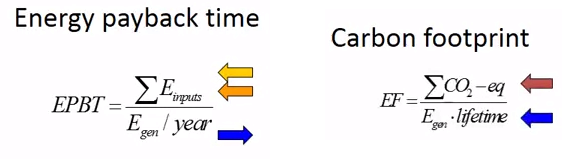

# Week 1 - Lecture 3 and 4 - Life Cycle Analysis

* How to measure the impact of polymer solar cells?
*
* Processing;
* Operation;
* Decommissioning;
* End of Life Management;

* There are two methods to this analysis:
*
* **Life Cycle Analysis** (LCA);
* **Environmental Impact Analysis** (EIA);

**Assignments inLife Cycle Analysis

*** A tool to guide research in nanotechnology and eco-design;
* Environmental impact requires sound data and thorough analysis to understanding;
* The objective is obtain clean and renewable energy sources:
*
* Abundant materials in production;
* Low energy payback time;
* Low carbon footprint;
* Low emission;
* Efficient land use;

* The general life cycle of a photovoltaic cell is:

*
* **Raw Material Acquisiton**: Includes processes related to extraction and refining;
*
* To OPV used in the course, it's polyethylenetherfalate (PET), so raw material is natural gas;

*
* **Manufacture**: Coating several function layers into film;
* **Distribution**: Transporting and stocking products for consumption;
* **Use**: Stage where products perform a useful service to the consumer;
* **End-of-life Stage**: Product enters the waste management system. Depending of local service, this can be recycled or incinerated;

* **Life Cycle Analysis** is a method to access the environmental impact of a product, process or services that involves four major steps: (ISO 14040)

* **Life Cycle Analysis** should include all non-negligible impacts. Applying in simple way do photovoltaics:
*
* **Goal and scope definition**:
*
* OPV uses to obtain electricity;
* Identify hotspots;
* Guide research;
* Support public policy decision;
*
* Rigorous study;
* Extensive documentation;
* Peer review;

* Functional unit: kWh
* Reference flow: m^2

* **Inventory analysis**:
*
* Collect inputs in each life cycle step;
* Materials;
* Processes;
* Transport;
* Electricity;
* Releases;

* It's useful to use a software to:
*
* Order life cycle steps;
* Analyze results;
* Ecoinvent database;

* **Impact assessment**:
*
* Inputs and outputs from the previous inventories are assigned to each impact category;
* Impact categories:
*
* Climate change;
* Eutrophication;
* Ozone depletion;
* Human toxicity;

* In the end, determines impact potential;

*
*
* **Energy Payback Time**: Time that it takes to produce as much energy as it was invest in the production and its whole lifetime;
* **Carbon Footprint**: Mass of equivalent CO^2 per generated electricity output;

*
* **Interpretation**:
*
* Identify key parameters in the inventories to detect relevant contributions:
*
* Energy balance;
* Material fluxes;
* Emissions;
* Wastes;

* Complete information:
*
* Check consistency;
* Make sensible studies;
* Consider data uncertainties;

*
* We'll use it to ensure that we have the best possible solution for the environment and for our future;
