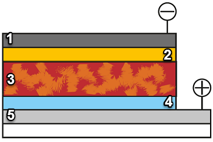
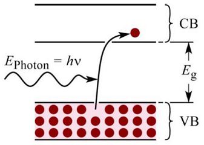

# Week 2 - Lecture 1 - Working Principles

**Working Principles**

* **Absorption of Photon** in a active layer;
* **Creation of Exciton**: the core-hole pair;
* **Exciton diffusion** through a phase boundary between the polymer donor and acceptor;
* **Charge separation**;
* **Charge transport** to the electrodes;

**Summary of the build-up of typical Solar Cell**

* About each layer of Solar Cell:

1.
1. **Electrode** (Anode);
2. **Electron Transport Layer**;
3. **Active Material**:****Semiconductor by two constituents:
* Donor material: The polymer which absorbs the light with great affinity for holes;
* Acceptor material: Blend with a large affinity for electrons. Generally, fullerenes.

4. **Hole Transport Layer**;
5. **Outer electrode** (Cathode): in this case, the transparent one;

* **Semiconductors** are materials which conductivity is halfway between a normal conductor, like metal, and a insulator, where there is a big gap between filled and empty states;

*
* In semiconductors, **a photon can excite an electron of filled band** (VB: Valence Band) **to empty band** (CB: Conduction Band);
* Silicon is used in solar cells as **indirect gap material**: **needs a photon and a phonon** (a lattice vibrational excitation) to promote an electron to CB. Needs a thicker slab of material;
* **Direct band gap materials** can be much thinner, like inorganic and organic thin films;

* To use a material as active layer of a solar cell, it needs a low band gap to realize the electron excitation with wavelengths that could be received from Sun at sea level. The maximum is in the visible radiation (390-700 nm);
*
* The low band gap property produces a limited voltage, then a theoretical efficiency limit (Shockley-Queisser limit);
* Silicon has a band gap of 1.1 eV, resulting in a maximum power conversion efficiency about 29%;
* Greater is the band gap, less sunlight is absorbed and lower is the conversion efficiency;
* The theoretical efficiency limit for an infinite junction solar cell is 86%;

* The formed exciton can diffuse through the material but lifetime is limited. The distance it can travel is very small (10~20nm);
* Junctions could be:
*
* **Bi-layer geometry**: a older type, has only one layer of the donor polymer and one layer of acceptor. Not very effective because of great distance;
* **Bulk heterojunction**: a microphase separated material where the donor polymer and the acceptor are ordered n several domains where exciton can travel;

* To generate electricity, the charge carriers must travel to separate electrodes rather than moving randomly about. It's done by using different electrode materials, with different energy levels, to create a internal electrical field;
