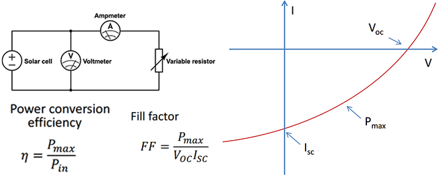

# Week 2 - Lecture 2 - How to characterize solar cells?

**How to characterize solar cells?*** The most important parameters is **Power Conversion Efficiency**: Ratio between the electrical power output of the solar cell and the incoming power of the light;
* To test this, should use the **Sun** or a **calibrated lamp**, with the same spectrum and light intensities of the sun;
*
* One Sun is defined by 1000 [W/m^2] (equivalent to outside in a clear day);

* Also is needed the measure of voltage (V) and current (I) output of the cell. A multimeter can be used;

* **Fill factor** gives information about the shape of IV curve.
*
* It is a ratio between the maximum power and the **open circuit voltage** (Voc) and **short circuit current** (Isc);
* Should be as high as possible and tells about internal resistance values in the cell;

* A solar cell can be modeled mathematically as an **equivalent circuit**:

*
* Circuit has two internal resistance values:
*
* **Series resistance** (Rs) would be low and due to a number of factors such as sheet resistance of electrodes;
* **Shunt resistance** (Rsh) should be high and tell about the parasitic currents;

* Estimative of resistant values can be calculated based on the slope of IV curve:
*
* Slope at Isc is proporcional to shock resistance;
* Slope at Voc is proporcional to the series resistance;
