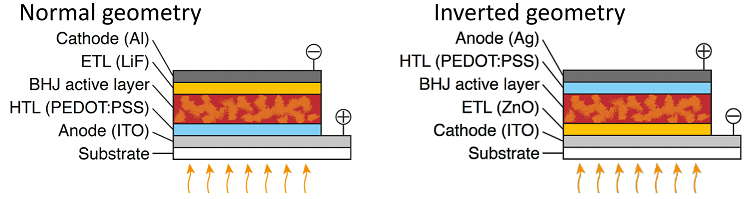
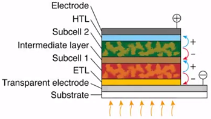

# Week 2 - Lecture 3 - Layers in the Solar Cell

**Layers in the Solar Cell*** There are **two main categories** of Solar Cells devices:
*
* Normal Geometry:
*
* The electrons are extracted at the back electrode and the holes at the front of the electrode;
* Received the name 'normal' because was the first device created;

*
* Inverted Geometry;
*
* Allows to use other metals as silver for the back electrode, that is less affected by oxidation;

* About each layer of Normal Geometry Solar Cell:

1.
1. **Electrode** (Anode);
* Collect charge carriers;
* Provide contact to an outer electrical circuit;
* Should be highly conductive, generally metals, like aluminum;

2. **Electron Transport Layer**;
* Can be titanium oxide (TiO2), zinc oxide (ZnO) and lithium fluoride (LiF);
* Cesium carbonate (CeCO3) has been used in high efficiency solar cells recently;

3. **Active Material**:****
* Semiconductor by two constituents:
*
* **Donor material**: The polymer which absorbs the light with great affinity for holes;
* **Acceptor material**: Blend with a large affinity for electrons. Generally, fullerenes;

* Junctions could be:
*
* **Bi-layer geometry**: only one layer of the donor polymer and one layer of acceptor. Not very effective because of great distance to exciton diffuse between donor and acceptor materials;
* **Bulk heterojunction**: a microphase separated material where the donor polymer and the acceptor are ordered n several domains where exciton can travel;

4. **Hole Transport Layer**;
* Most used is PEDOT:PSS;
* Molybdenium oxide (MoOx) and vanadium oxide (V2O5) has been also used;

5. **Outer electrode** (Cathode): in this case, the transparent one;
* To allow light to penetrate into cell, one of the electrodes should be transparent;
* Indium tin oxide (ITO) is a example of material with high conductive and transparent, combined with PEDOT:PSS;
* One option is to use a very thin metal grid that does not block much of incoming light in combination with semitransparent conductor such as PEDOT:PSS;
* Trilayer structure of a silver grid, PEDOT:PSS and an electron transport layer based on zinc oxide (ZnO), named as Flextrode, is used as substitute to ITO for inverted structures;

6. **Substrate**: Main used substrates are glass (stiff) and plastic (flexible). They're applied using spin coating or evaporation;
* Glass is a very heat stable very good barrier material to oxygen and water;

* One of great attractions of polymer solar cells is that it can be mass produced in great quantity at a low pricing using **printing and coating technologies**;

* **Tandem Cell**:
*
* Two stacked cells on top of each other;

*
* They each harvest a different part of the solar spectrum, doubling the achievable efficiency by adding up the voltage for each cell;
* Technically more difficult to build:
*
* Requires a selective choice of polymer materials with different absorption spectra;
* The top cell does not block light from entering the bottom cell;
* Needs to develop an intermediate layer between the cells forming an ohmic contact;
