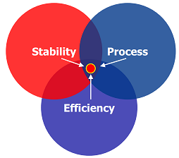
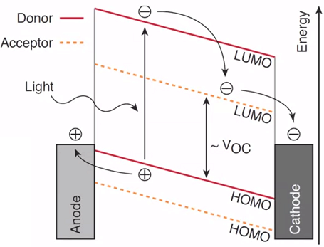
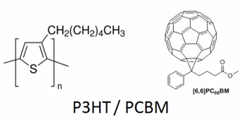

# Week 3 - Lecture 1 - Materials in the Active Layer

* Design of Polymer Solar Cells has three main areas. We want a polymer that fulfills all these criteria:

*
* **Stability**: Documented a lifetime up to one year outdoor. A longer lifetime is need to be comparable to other photovoltaics;
* **Efficiency**: We have up to 3~4% of the P3HT-PCBM mixture;
* **Process**: Requirements to go to very large scale, including coating and printing;

* Remember that active layer is composed by a polymer or small molecule, acting as donor, and a acceptor material;
* The polymer is a conjugated material, which absorbs the light and an electron is excited from HOMO to LUMO orbital. After, the electron is transferred to acceptor and we have the charge separation;
**

****Acceptors****

**

*
* Acceptors are generally **fullerenes:**

*
*
* Starts with **C60**, but is not very soluble in common organic solvents, creating a bilayer and not a heterojunction;
* **PCBM** is a soluble derivative made possible to made a heterojunction where the donor and acceptor is mixed. Charge transfer is more efficient;
*
* PCBM can be also be prepared with **C70**. It's more expansive but it's possible to tune the band gap (acceptors LUMO);
* **Bis-adduct IBCA**, where the LUMO level is 0.17 eV higher than PCBM;

*
* **Polymers** can also be used as acceptors:
*
* It has the advantage that gets absorption from both polymers and to tune the energy gap;
* Solution viscosity is also easier to control;
* Polymer/Polymer OPVs have much lower efficiency and poor miscibility;

****

****
**Polymers**

* It's monomer combined together.
*
* Thiophene combined in a length of chain: Polythiophene;

* Sidechains can be modified to improve solubility, like alkyl or ester;
* Polymers must to be **conjugated** (switch between single and double bonds);
*
* They suggest that pi electrons can diffuse over the entire molecule. Pi electrons are the one that can be shifted upon absorption of the visible light (pi->pi*);
* Absorption depends on conjugation length;

* P3HT/PCBM is a example of a polymer largely studied:

*
* Presentes 3~4 % of efficiency;
* Relatively stable;
* Possible to process in large scale by solution;
* Bad matching with the solar spectrum;
