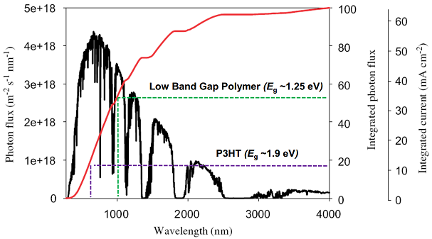
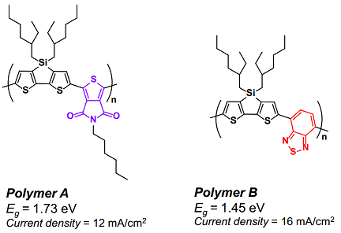
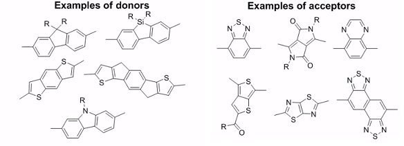

# Week 3 - Lecture 2 - Polymers

**Efficiency**

**

**

**

**

* A polymer P3HT has band gap equal 1.9 eV, which means that absorbs light up to around 600 nm.
*
* Comparing with solar photon flux, P3HT will only absorb 17% of photons.
* If all of them are converted to electricity, we can get a current of 11 mA cm^-2;
* In polymer B we reduce the band gap to 1.25 eV, resulting in a absorption of 53% of photons;

* **Low band gap polymers** have band gap lower than 2.0 eV (> 600 nm);
*
* In POVs, this kind of polymers reaches 10% of efficiency;
* Optimum band gap is around 0.7 eV using PCBM as acceptor;

* How can we obtain this low band gap?
*
* An efficient inter-chain Charge Transfer, interspersing donor and acceptor groups;
* Aromaticity groups, like PITN, presents high stability and band gap around 1 eV;

* **Example**: Changing the acceptor group, we have a great change on the band gap.

* Some examples of donors and acceptors unities:

**Stability**

* **Photochemical Stability**: Relation of polymer unities and resistance to photochemical reactions;
* **Morphological Stability**: Crosslinking and Thermocleavable materials;

**Processing**

* **Sidechains**: Ensure that the polymer is soluble in common solvents (like chloroform and water);
* **Large Scale**: Important make the production in large scale;
