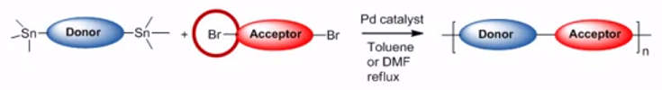
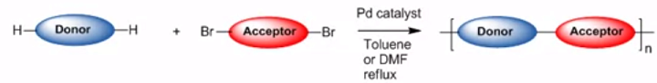

# Week 3 - Lecture 3 - Synthesis

**Polymerization Methods*** **Still Cross Coupling**:
*
* Uses a halogen, normally bromine, to activate the monomer;
* It's coupled with organo-tin activated monomer unit;

* **Suzuki Cross Coupling**:
*
* Also uses a halogen monomer;
* Instead of organo-tin activated monomer, it uses a boronic ester activated monomer;

* **Direct Arylation**:
*
* Recently developed method;
* Don't need activation for one of the monomers;
* Save us for one step in the complete synthesis, since we don't have to activate one of the monomers. It's more environmentally friendly.
* However, polymers synthesized by this way gives lower efficiency POVs;

**Monomer Activation**

**

**

**

**

* Acceptor unity can be threated with NBS and THG, adding the bromine to the monomer. Simple reaction with high yield;
* For donor unity, we can activated to a boronic ester or a organo-tin;
*
* Boronic ester cannot react directly on the units, then is nedded a activation group like bromine;
* Stannylation is more simple;

* Monomers also needs to be purified:
*
* Flash Chromatography;
* Solid State Chromatography;
* Recrystallization;

* After synthesis, the polymer could be extracted with a soxhlet using different solvents;
