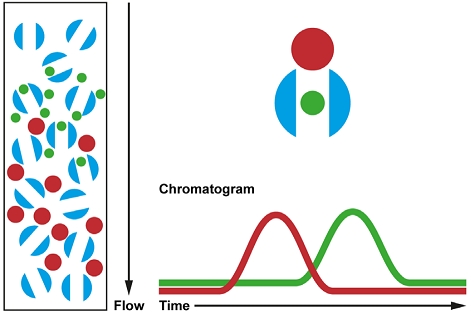

# Week 3 - Lecture 4 - Characterization of Polymers

**Parameters that affectsEfficiency

*** **Molecular Weight Distribution:** Measured by Size Exclusion Chromatography (SEC);
*
* Gel Filtration Chromatography (GFC): Uses hydrophilic packaging;
* Gel Permeation Chromatography (GPC): Hydrophobic packaging. Used to analyze polymers;

*
* In SEC, we have an injection of sample onto a column with porous packaging;

*
* Different sizes of polymers are separated when small molecules are captured in porous packaging;

*
* A detector can be used to indicate molecules passing by;

*
* Polydispersity (PDI) is the ratio between number average molecular weight (Mn) and weight average molecular weight (Mw);

*
*
* In OPVs, we like to use polymers with a high molecular weight (Mn>20000) and low PDI (2<PDI<4);

* **Absorption**: The amount of light absorbed at a given wavelength;
*
* Extinction Coefficient (Molar Absorptivity) can be obtained by Lambert-Beer Law. Tells how strong the polymer absorbs;

*
* Transitions pi->pi* are characteristic from visible spectrum. Conjugation length is inversely proportional to energy transition (band gap);
* Electrochemical Band Gap can be measured by cyclic voltammetry;

* **Carrier Mobility**: Mobility of electron or hole;
*
* Higher is the mobility, higher is the charger transport efficiency;

**Parameters that affects Stability**

* **Photochemical Stability**:
*
* Shine light on the polymer sample and measure the absorption over time;
* It's possible to see when the polymer degrades by changes in UV-Vis spectrum;

* **Thermal Stability**:
*
* Thermal gravimetric analysis (TGA) measures the weight of polymer over temperature;
