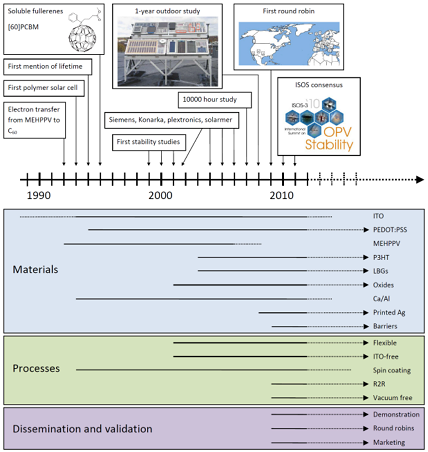
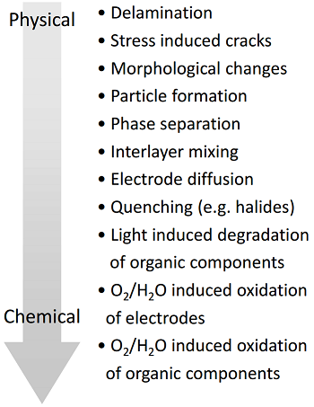

# Week 4 - Lecture 1 - Stability and Degradation

* It's a very important topic due to the fact that many organic materials exposed to sunlight and oxygen decomposes;
* If you want to manufacture solar cells commercially, then they must be able to last for a long time, comparable to other photovoltaic technologies;
* The number of scientific publications about POVs including degradation is also low in the last years;
* Stability is a recent preoccupation in the scientific research:

**

**

**

**

* POVs are build with many different materials, that degrade in different ways and affects the stability;
* Common causes of degradation:
*
* Light;
* Oxygen;
* Humidity;

* Important degradation mechanisms list:

* Some improvement in degradation may require change of material but others can be solved protection, encapsulating it to reduce influx of oxygen and water;

* **Physical Requirements**:
*
* **Mechanical stability**: Should be able to withstand bending both during manufacture and also in deployment without delamination or internal fracture;
* **Spartial organization**: Defects and internal migration in the multilayer system may render the device ineffective;
* **Nanophase separation of active layer**: The optimum structure may not be the most stable and it can therefore change to a less efficient one over time;

* **Chemical Degradation**:
*
* Oxygen, water and electrode material reactions with the active polymer layer;
* Reactions rates for activation of organic polymers used differ greatly and it's plausible to select materials there are less prone;

* Examples of materials:
*
* ZnO is selective for transport of electrons but it may also react with oxygen and ultraviolet light;
* PEDOT is used to hole transport but it's hydrophilic and can retain water, that reacts with other components;
* Metals used for electrodes can also react with oxygen and water;

* One important strategy to protect metals from water and oxygen is encapsulate the cells with transparent materials that block the transport to the cell;
*
* Glass is ideal material but it's not flexible and difficulties the continuous roll to roll production;
* Special clear plastic films has been used recently to this propose;

* Stability have prompted a great number of scientists to focus on this area. ISOS has been created the host conferences and oversee this research area;
* Two ways to investigate stability of solar cells:
*
* **Symptom Testing**: Testing the specific solar cell by putting under conditions that may or may not resemble its daily use;
*
* Lifetime testing;
* Concentrated light;
* Temperature studies;
* Humidity studies;
* Controlled atmosphere studies;

* **Designed Experiments**: Uncover the degradation mechanisms involved;
*
* Destructive experiments;
* Non-destructive experiments;
