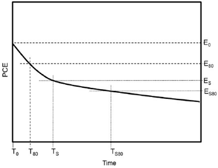
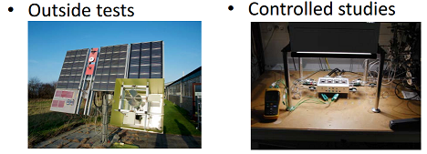

# Week 4 - Lecture 2 - Decay Curves

**Stability as function of time*** This treatment produces **decay curves** that vary according the circumstances that they are measured under;
* Decay curves are powerful tool but does not tell us anything about underlying degradation mechanisms;
* It can be used determine degradation speed under specific circumstances;

* A decay curve is obtained by testing a solar cell in electrical measurements at regular intervals;
* Power-conversion efficiency (PCE) is plotted against time;
* The curve course is a result of the sum of all degradation processes;
* Curves can vary considerably;

* It's stars out at an initial efficiency (E_0);
* The time it takes to reduce to 80% of E_0 value is called T_80;
* What is often observed is a rapid initial decrease in PCE, followed by a more stable phase;
*
* Initial stage is called burn-in phase and is not always considered part of the proper decay curve;
* Time at the end of burn-in phase is T_s;

* Several decay processes occur at the same time and some of them are very fast but operate only in the short term;

* Lifetime measurement experiments can be done:

*
* Controlled studies needs a **calibrated lamp** and a **atmospheric chamber** to select reagents quantities as oxygen and water;
* A interesting approach is to use **isotopically labeled reagents** to **discover where in the solar cell** they react;
* Sometimes degradation process are too slow to be tested in ambient conditions. To **accelerate** the study we can **increase the temperature or the light intensity**;
