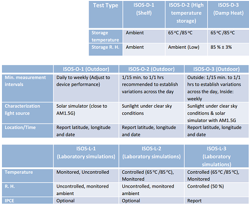

# Week 4 - Lecture 3 - ISOS Standards

**International Summit on Organic Photovoltaic Stability (ISOS)*** In OPVs, degradation curves take different types of shape easily, unlike PVs;
* A special organization created to organize conferences and oversee the research of OPV stability;
* ISOS also defines accurate measurement protocols and testing procedures;
* To standardize methods of analysis to OPV stability, they started studying methods used all over the world;
* Different light sources, for example, generates different results.
* Ambient temperature and relative humidity of samples storage also affects degradation rates;
* In outdoor tests, geographic localization affects the number of hours with effective sunlight, for example;
* ISOS standards were established for different types of tests:

* Light sources was also defined, based in represent the real spectrum of Sun, as metal halide lamp or xenon arc lamp with daylight filters;
* Eight parameters are defined to describe lifetime of solar cells:
*
* Initial efficiency (E_0);
* 80% of initial efficiency (E_80);
* Efficiency after burn-in phase (E_s);
* 80% of efficiency after burn-in phase (E_s80);
* Initial time (T_0);
* Time to reach 80% of initial efficiency (T_80);
* Time to burn-in phase (T_s);
* Time to reach 80% of efficiency after burn-in phase (T_s80);
