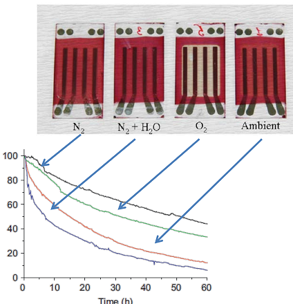
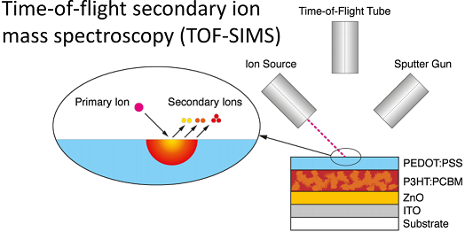

# Week 4 - Lecture 4 - Stability Examples

**Chemical Degradation*** The main chemical degradation mechanisms involve:
*
* **Oxygen**: React with active materials in a photo oxidation that eventually breaks them down and destroy the ability to absorb light;
* **Water**: Transport layer and electrodes may react with water;
* **Light**: Photochemical reactions;

**Physical Degradation**

* **Morphology:** Active layer is optimized for charge transport having the right size domains of each component. Rearrangements by heating may destroy the structure;
* **Delamination**: The weak interfaces between active layers can cause problems. For example, hole conductor PEDOT:PSS and the active layer;
* **Electrical shorts**: Happens if the electrodes can connect themselves;

**Study Example**

* Four identical devices with aluminum back electrodes were used, putted into four different closed atmospheric chambers:

*
* The device in pure nitrogen atmosphere decays at the slowest rate;
* Water affects this device more then oxygen;

*
* To a better understanding, surfaces are analyzed by **TOF-SIMS**:

*
* A jet of inert gas is used to remove the top layer of atoms wich are analyzed;
* Isotopically labeled oxygen was used. It's possible to note that they was concentrated near pin holes;

* Water reacts much more aggressively with aluminum, generating oxides and hydroxides, which are electrical insulators;
*
* An alternative solution to aluminum is silver as electrode in inverted geometry cells;

* **Encapsulation** is a method to protect the devices;
*
* **Glass** is one of best materials to this because its transparency but it's stiff and heavy;
* A better alternative is clear **plastic film** with good barrier properties;
