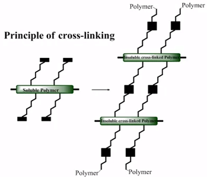
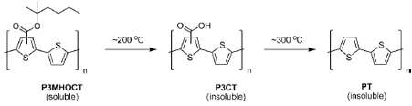
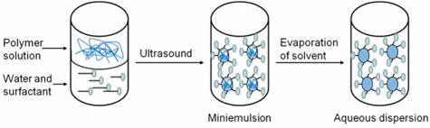

# Week 4 - Lecture 5 - Morphological Stability

**Characterization of Active Layer Morphology*** Unfortunately, optimal morphology is not always stable over time;
* Domains goes to microscopic size, decreasing the solar cell functionality. This effect can be observed by microscopy;

* An ideally solution to this change is create novel active materials where the most stable configuration coincides with a morphology that gives best solar cell efficiency;
* A more common solution is immobilize the base morphology build in a **cross-link**:

*
* Side-chains helps to solubilize polymer in the ink. If this side-chains are removed after the active layer has been formed it will also reduces the mobility and prevent changes in the morphology;
* As example, P3HT with a bromine in the side-chain. When mixed with PCBM and processed in the active layer, it's possible to photo cross-link the material with UV light;

* Other possibility is to remove the side-chains altogether. Needs a very special chemistry to cleave them off at relatively low temperatures:

* At least, it's possible control morphology by pre-form nanometer sized particles, kept in water suspension using soap molecules:

*
* This is done by sonication to form an emultion of the ink particles in the water;
* Organic solvent is removed by evaporation;
* An added benefit is that the solvent used in the production is water instead of harmful organic solvents;
*
