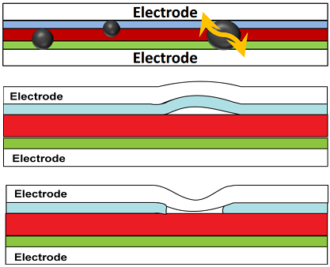

# Week 4 - Lecture 6 - Electrical Defects

* A more direct electrical defect may be in the form of **particles** or **delamination** in the layers of the device creating **electrical shorts** and **open circuits**;
* OPVs are subject of electrical defects because of layer thicknesses (tens to hundreds of nanometers);
* Even small particles may form a conducting path between them, causing reduction of resistance or even an electrical short;
* Examples of electrical defects:

* IV curves can't indicate where the defects occurs. For this we use:
*
* **Light Beam Induced Current** (LBIC):
*
* Uses a laser to scan over the cell, measuring electrical properties in each point;
* Produces an electric map of the solar cell;

* **Lock-In Thermography** (LIT):
*
* Produces a thermal map of the solar cell;
* Uses an infrared camera in the 3 to 5 micrometers wavelength range;
* Based in the principle that optoelectronic devices are periodically excited with a fixed frequency;
* Electrical defects causes the increase of local temperature;

* Electrically conducting particles that span the whole depth of solar cell can create a low resistive area;
