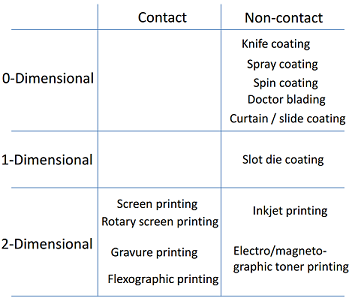
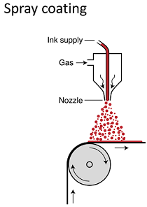
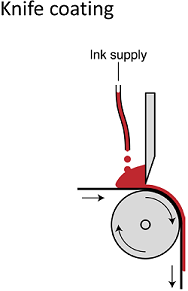
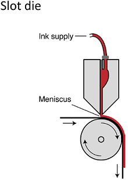

# Week 5 - Lecture 1 and 2 - Coating

* To start OPV manufacture you need **Ink**:
*
* A liquid;
* Typically most of it is solvent. For example:
*
* Water;
* Organic solvent, as chlorinated solvents;

* Organic material (polymer, fullerene, etc) that you need to deposit the layer is solubilized in this solvent;

* Ink is deposited on a thin substrate;
* For each particular ink, for particular layer, there's a particular optimal deposition method;
* There are two great groups: **coating technique** and **printing technique**;
* OPVs usually have a multilayer stack (4~16 layers for each purpose);
* Both techniques has dimensionality in the lateral plane and horizontal plane:

* Coating techniques are generally all zero dimensional;
* **Non-contact techniques** means that they are either spraying the ink onto the surface;
*
* We can just be pouring over it or forcing through a narrow gap between a moving gap and a knife;
* When this dries, you get an even dry film;

* **Slot Die coating** has the slight advantage that you can control the wet thickness within a given range;
* **Spin coating** is a very useful laboratory coating method but not used industrially;

**Spray Coating**

* **Spray coating** is like spray painting an object:

* Has some control over thickness: more you spray, more liquid you deposit and more solid you get in the dry film;
* Is possible to use through a shadow mask, forming a pattern, but it's hard to do and spend ink in the mask;
* Drying to an even film is ofter a very delicate interplay between ink and drying and how the liquid particles are formed in the nozzle;
* Evaporation process has heavily impacts to morphology;
* It's simple to do but difficult to control when it comes to establishing a desirable morphology;

**Knife Coating**

* Basically put ink on the surface;

* Put the ink over the surface and force it between gap formed by substrate and knife;
* Only allows for fully coated surfaces;
* Has a good film thickness control;
* Could be applied to very large areas and very smooth surfaces;

**Spin Coating**

* Often used in laboratory. It's fantastic because you can make very small substrates and it's very reproducible;

* Basically spin the substrates, typically a small object with size of a microscope slide or a few centimeters by few centimeters;
* Thickness of the film is a complex interplay between the sheer rate formed at the surface and evaporation rate of each liquid;
* Controlling rotation speed and viscosity, it's possible to reproduce films with certain smoothness and thickness;
* One disadvantage of spin coating is you add perhaps a milliliter or less of ink and in the reality most of this is lost by ejection in the spinning process;

**Slot Die Coating**

* In this technique, ink is not in atmosphere exposure. It's a closed system;

* Ink is only exposed in a point very close of application;
* You can control the wet thickness, within a window, by substrate speed and pumping;
* Can give very smooth films;

**About Coating Techniques **

* Coating techniques generally apply an even layer in the horizontal plane;
* It's possible to control vertical plane formation;
* Multilayer coating is also possible with different inks in the same coating step:
