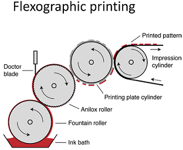

# Week 5 - Lecture 3 and 4 - Printing

* Printing techniques are two or even three dimensional contact techniques;
* The ink used in printing is, in some cases, identical to used in coating, but can be also quite different;
*
* There's liquid inks and also dry inks, without solvent. Avoid solvent use is good environmentally;
* Dry inks are difficult to use because we usually want thin layers;
* Examples of dry ink techniques: Magnetography, electrography;

**Useful Printing Techniques for Organic Solar Cells**

* **Flatbed Screen Printing**: Roll to roll compatible.

*
* Mesh or stencil that carries the pattern is brought into contact with the surface;
* You have open areas, with a permeable material, and closed areas, to form the ink pattern;
* The ink is deposit onto the substrate through the mesh;
* Thickness of wet layer is defined by the ink property and the mesh;

* **Rotatory Screen Printing**: Full roll to roll compatible;

*
* It's exactly the same as flatbed screen, except that folded the flat screen into a cylinder;
* Printing masks has been made by an electroformed or laser engraved mask, typically a metallic material where you have holes in it;
* It's an inherent roll to roll method and can run much higher speeds than flatbed;
* Both produces two dimensional patterns, so can print letters or closed circles;
* Screen printing are inherently thick films techniques but it's difficult to get into the thin film regime;

* **Gravure Printing**:

*
* Uses a metallic cylinder where you have an engraving;
* It's strongly dependent of ink surface tension and the surface that you wish to print upon;
* It's a very fast production method;

* **Inkjet Printing**:

**

**

*
* It's a non-contact technique;
* It sprays out ink through fine nozzles using a piezoceramic system;
* Can have an continuous droplet generator or a programmed one to generate pictures;
* Don't need a master cylinder, then can be adapted easily to print the forms that you want;
* Very robust to use in industry;

* **Frexographic Printing**:

*
* Requires more rollers than others techniques;
* Starts with a fountain roller that pickup the ink, putting it in a anilox roller (like a gravure cylinder);
* Instead of directly printing onto the surface, we have your stencil, a raised topography roller, that is brought into contact with the engraved cylinder (anilox);
* A rubber stencil (printing plate) that transfers the ink to the surface of substrate;
* It's a high resolution printing that can make very thin films;

**Technical Informations of Production Methods**

