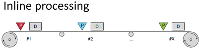
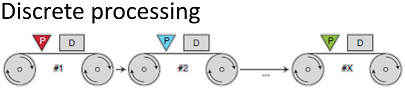
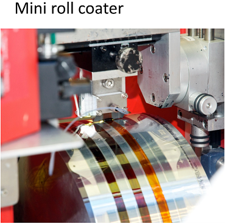

# Week 5 - Lecture 5 - Upscaling

**Upscaling Processes*** **Inline Processing**:

*
* Everything is done in the same passage through the machine;
* Applies all the layers at the very end of the machine and can roll it back off as a finished solar cell;
* It's the most industrially adapted method for a completely finished product;

* **Discrete Processing**:

*
* It's still a roll to roll process but where we are doing one step at a time on the roll;

* **Mini Roll Coater**:

*
* The mini roll coater has the advantage that it eliminates a lot of the sources of error that you have on a large roll to roll processing machine;
* It's a relatively simple machine;
* It doesn't touch the front side (surface) of the foil;
* It's needed a lot of control of equipment;
