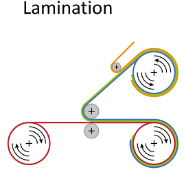
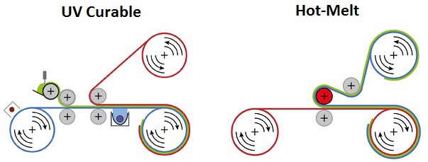

# Week 5 - Lecture 6 - Testing and Encapsulation

**Testing*** It's a necessary procedure, then you also need a roll to roll test machine;
* Tests could be:
*
* IV Testing;
* Light-Beam Induced Current (LBIC) Testing;
* Simple Voltage Testing;

* Individual solar cell testing becomes difficult;

**Packaging**

* It's important to protect from atmosphere (oxygen and water);
* It's an expansive step, time consuming and presents potential lost of material;

* **Lamination** is a totally different process:

*
* We apply an adhesive of some sort (epoxies, acrylics, etc), forcing two foils together;
* **Pressure sensitive** is the easiest method. Applies clue in one foil and put them together, but permeability of water and oxygen is very high;
* **UV Curable or Hot-Melt** threats the glue of foils during lamination:

*
*
* UV Curable has, by far, the most performing, specially because avoid high temperatures, turning fast and cheaper;
