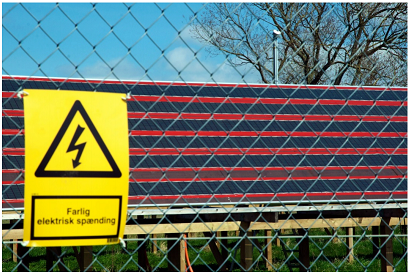
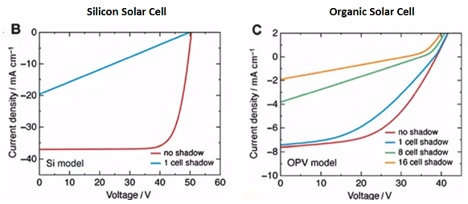

# Week 6 - Lecture 1 - Going Large Scale

* A great landmass is required to produce a significant quantities of energy from OPVs;
* Rolls of solar cells needs to be produced;
* Light harvesting device could be build:

*
* A system to apply the roll and remove after the end of lifetime can be applied also;

* Recycle of solar cells is a important way to threat the lifetime problem;
*
* Materials as silver are easy to be extracted and reused;

* OPVs are used in serial connections, that demands thin conductors and possibility high voltages and production by printing methods;
* Comparing serial connections of photovoltaics, organic PVs presentes an interesting advantage over silicon when you close the circuit with a shadow:

*
* In a 80 cells system, the effect to shadow 1 inorganic cell (reducing 90% the efficiency) is the same that 16 organic cells in the shadow;
* This way, OPVs can realize the dream of Solar Energy Parks;
