# Week 2

**Ideal Gas Equation of State**

* Gases are the simplest phase, facilitating the thermodynamics description

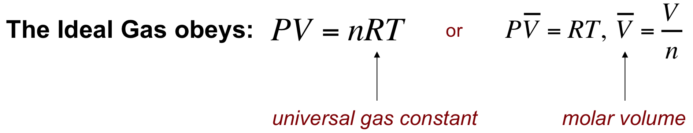

* Some definitions:
*
* _Extensive Variable_: Depends on the size of the system: volume, mass, energy...
* _Intensive Variable_: Does not depends on the size of the system: temperature, pressure, density...

* Relations:

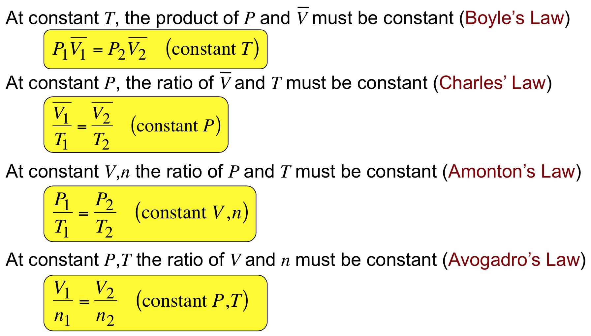

**Non-Ideal Gas Equations of State**

* _Compressibility_ (unitless):
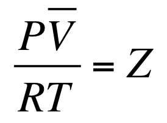

*
* Ideal gases presents compressibility equal 1.0
* Gases that presentes variable compressibility are called non-ideal

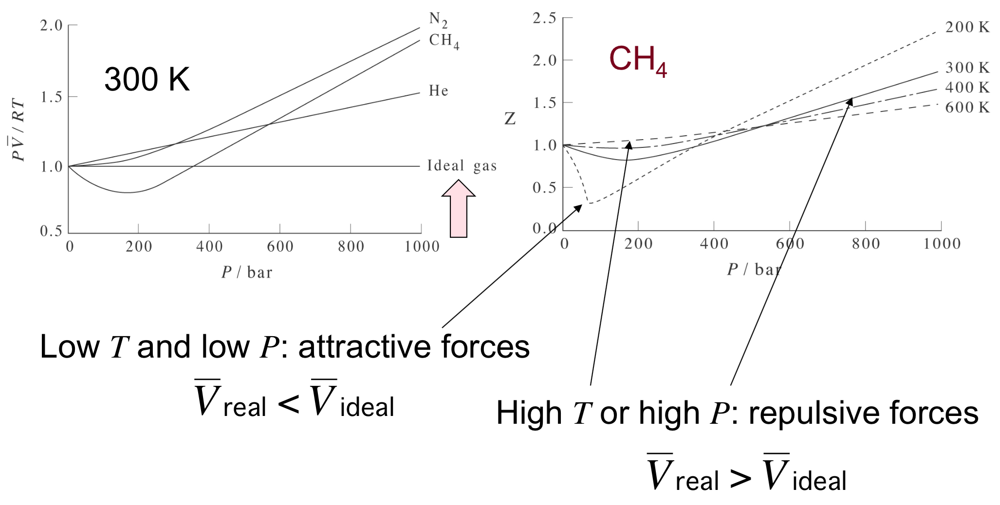

* van der Waals Gas:

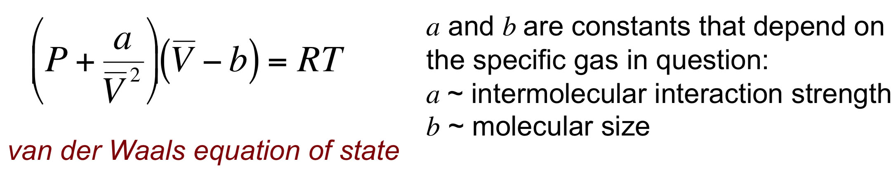

* Examples of Cubic Equations of State:
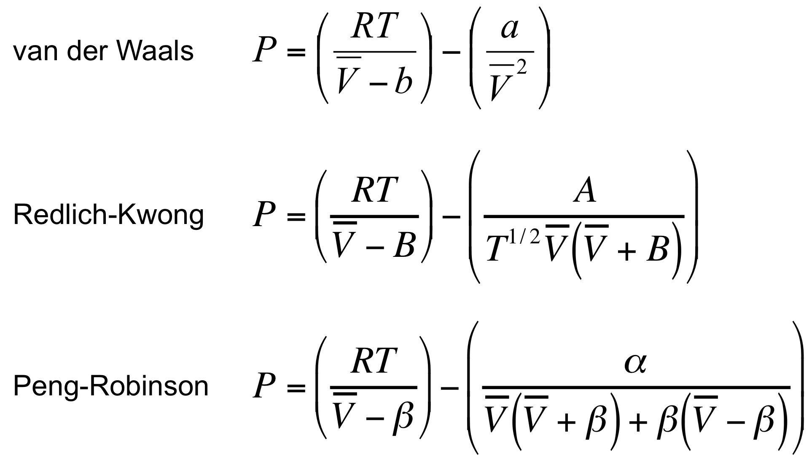

*
* More complex equations are necessary to describe real gases at high pressures
* Redlich-Kwong and Peng-Robinson equations perform reasonably good descriptions to liquid phase, as well

**Gas-Liquid PV Diagrams**

* Carbon Dioxide Diagram:
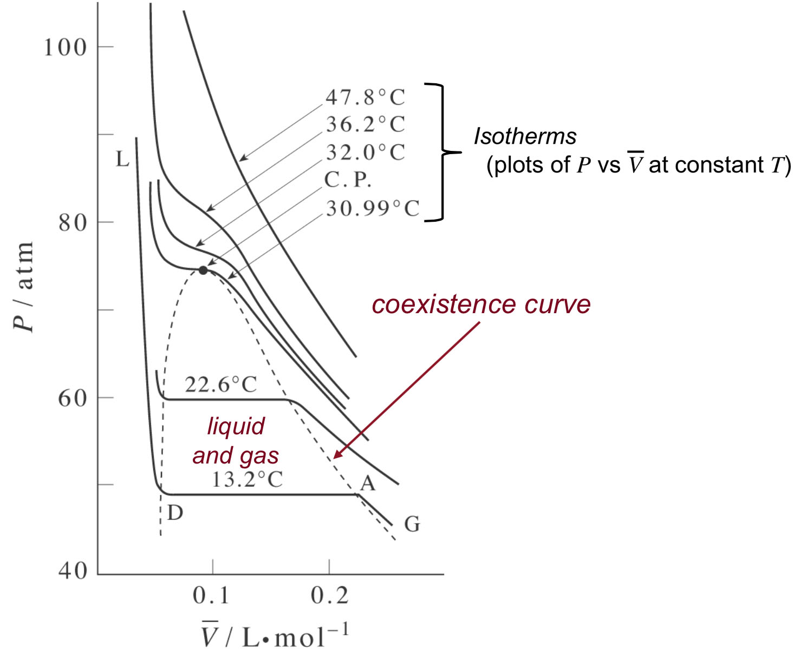

_

_
*
* _Critical Temperature_: Temperature which a gas cannot be liquified anymore

**Law of Corresponding States**

* Law of Corresponding States: _All gases have the same properties if compared at corresponding conditions_
* Corresponding conditions are relative to critical conditions
* van der Waals corresponding equation:

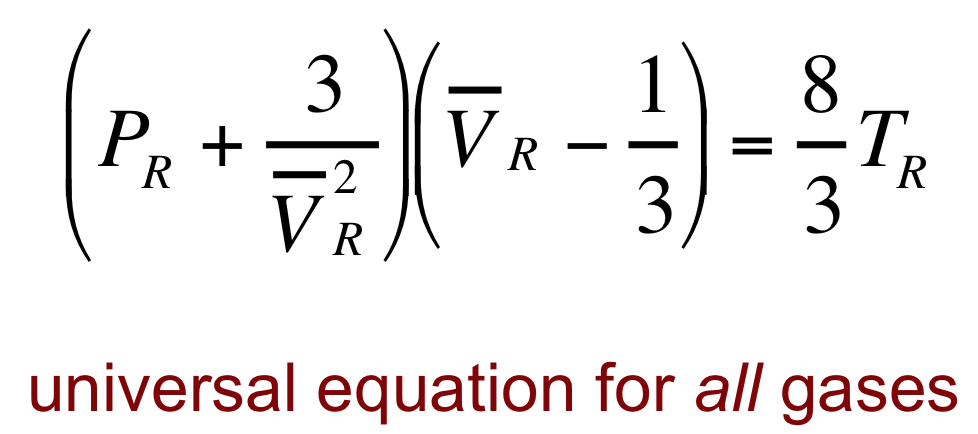

**Virial Equation of State**

* _Virial Expansion_: Compressibility is expressed as an infinite series expansion in the density or pressure

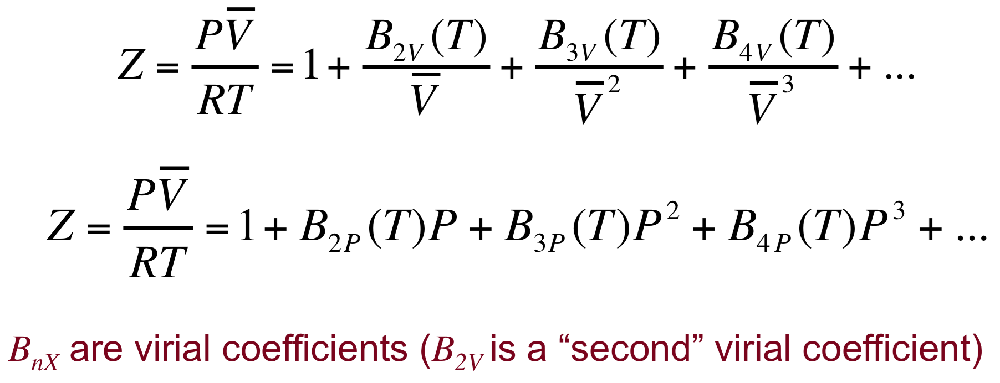

* The virial expansion equation has the correct form to show ideal gas behaviour at the limit of infinitely low pressure

**Molecular Interactions**

* The Virial Expansion derives from exact relationships between virial coefficients and intermolecular interactions
* Interactions are present in B2v and can be described in function of a potential _u(r)_ that can be calculated by Quantum Mechanics

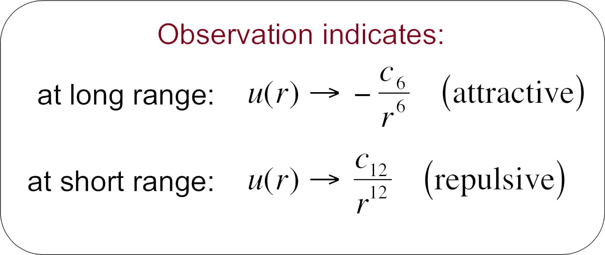

* Lennard-Jones proposed a parametric potential function to describe this kind of properties:

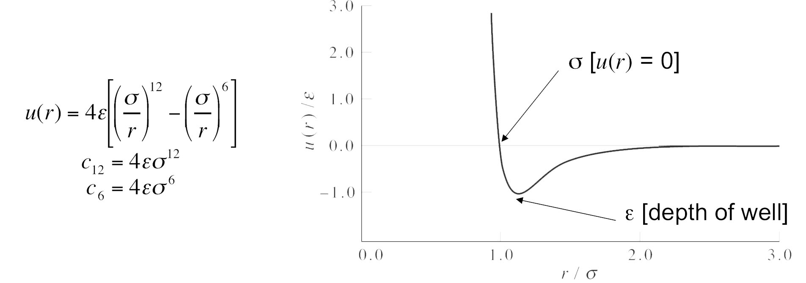

* _Boyle Temperature_: Temperature which every gas behaves as though ideal (B2v(T*)=0)

**Other Intermolecular Potentials**

* Attraction terms of intermolecular interactions:

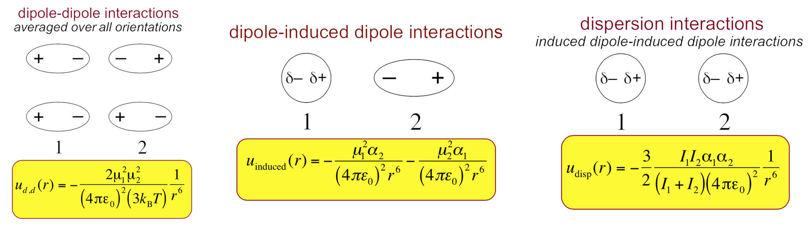

* Dispersion Forces:
*
* Described by Fritz London
* Quantum mechanical effect with no classical analog
* Caused of the correlated motions of electrons in quantum particles

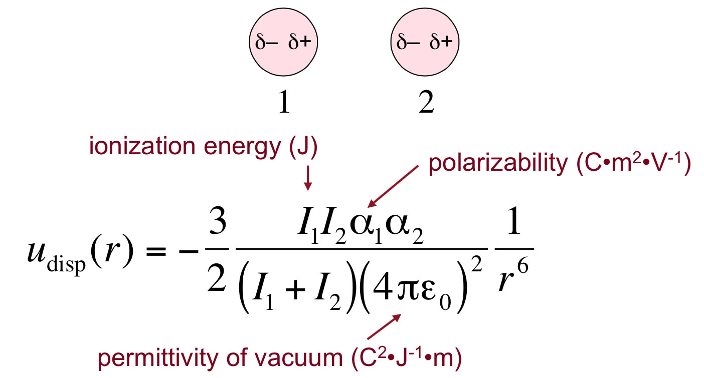

* Simpler models to describe intermolecular interactions:

