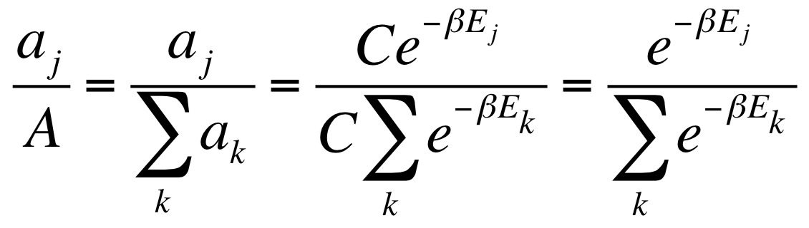
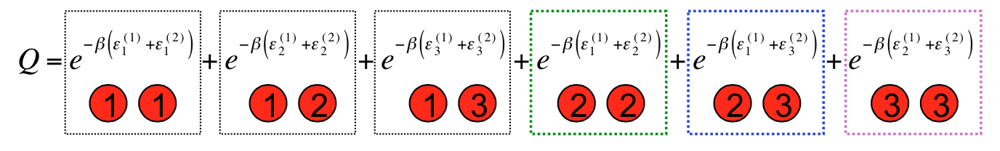
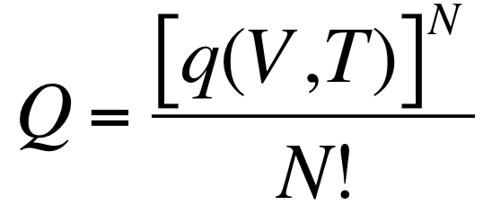

# Week 3

**The Boltzmann Probability**

* **Thermodynamics** is the study of energy and its transformations
* **Classical thermodynamics** encompasses a very powerful set of laws, but they offer zero molecular insight
* **Statistical thermodynamics** was developed to connect microscopic properties to the already well established macroscopic behavior of substances
* Statistical thermodynamics relates the averages of molecular properties to bulk thermodynamic properties, like pressure, temperature, enthalpy, etc

* _Number of States_: ai indicates the number of components in a ensemble having the energy Ei(N,V)

*
* C and β are arbitrary positive constants yet to be determined

---

**The Boltzmann Population**

* _Normalized probability_: _pj_ express the probability of a state _j_ in terms of total number of states _A_

* _Partition Function_: Describes the statistical properties of a system in thermodynamic equilibrium

*
* where β, which has 1/energy units, must be: (obtained by connection between classical thermodynamics and statistical mechanics)

*
* And rewrite as function of temperature:

*
* Assuming that the ground state is non-degenerated and the energy is taken as zero:

*
* In terms of temperature, note that:
*
* when T  0, the partition function Q  1, which means one unique accessible state
* and when T  ∞, Q  Total Number of States, which means all states are highly accessible

*
* The Partition Function is an effective measure of the “accessible number of energy states”

*
* In terms of “density of states” (how closely spaced are the relative energy levels):
*
* when density of states  0 (means that states are infinitely separated), so Q  1
* when density of states  ∞ (means that states are closer), so Q  Total Number of States

*
* Examples of partition function behaviour changing the energy gap between states and the temperature:

* Boltzmann population equation:

---

**Ideal Gas Internal Energy**

* _Fundamental Postulate of Statistical Thermodynamics_:

“The observed energy of a given system corresponds
to the average energy over all possible states of the ensemble each weighted
according to its respective probability"

* Relations between Energy and the Partition Function:
*
* Some derivatives of Partition Function:

*
* Then, we found a relation between derivative of partition function logarithm in terms of β, applying the chain rule:

*
* Writing in terms of temperature instead of β:

*
* Then, rearranging:

* Simple Example: Monoatomic Ideal Gas
*
* Given the following partition function Q, then:

*
* Comparing with the internal energy of a monoatomic ideal gas:

*
*
* This result demonstrates the power of statistical thermodynamics. From _microscopic properties_, it’s possible to calculate a _macroscopic quantity_ that can be measured
* The universal gas constant R is the product between Boltzmann’s constant and Avogadro’s number

---

**Ideal Gas Equation of State Redux**

* _Molar heat capacity of a substance_: the energy required to raise the temperature of 1 mole of that substance by 1 K

* Statistical thermodynamics can be used to understand “where the energy goes” when a system is heated and why the capacity to store energy is different for different substances by different partition functions in each case

* The Ideal Gas Equation of State:
*
* Using derivative of partition energy logarithm to volume and pressure expression as ensemble average:

*
* It’s possible, from microscopical description, obtain an equivalence to ideal gas equation of state

---

**van der Waals Equation of State Redux**

* A different trial function:

* Using the same procedure as in ideal gas case:

* Rearranging, we can compare with van der Waals equation:

---

**The Ensemble Partition Function**

* Partition Function is important to Statistical Mechanics as Wave Function is important to Quantum Mechanics
* Until now, we work with **canonical ensemble**, which _N_, _V_ and _T_ are fixed
* _Q_ is needed to compute macroscopic properties, but for an arbitrary system one needs all of the eigenvalues of its N-body Schrödinger equation to construct _Q_, which is rarely practical
* Fortunately, _Q_ can be approximated based on results for “individual” molecular energy levels

* For a system of distinguishable, non-interacting, identical particles the ensemble partition function (_Q_) can be written as a product of the individual molecular partition functions (_q_):

* Atoms and molecules are typically **indistinguishable**
* _Example_: Two particles with three possible energy states

* As particles are indistinguishable, some states are similar, as 1-3 and 3-1. Removing this repetitions:

* Two particles cannot have the same state, so:

* All of the overcounting of unallowed terms in _Q_ comes from failure to consider permutational symmetry in the labeling of the particle states
* A good approximation to take count the permutational symmetry is divide by _N!_:

---

**The Molecular Partition Function**

* Some examples of molecular energies obtained by statistical mechanics:

* The molecular partition function:

* States that have the same energy are called _levels_. The number of different wave functions that have the _same energy_ for a given level is called the **degeneracy**_g_
_

_
_

_

_

_
*
* The last expression is more convenient to use in future manipulations
* Example of degeneracy: Rotation partition function

