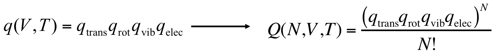

# Week 4

**Ideal Monoatomic Gas: qtrans**

* Partition Function of a non-interacting system, _Q_, in terms of individual partition functions, _q_:

* To apply to an ideal gas:
*
* The molecules are indistinguishable
* The number of states greatly exceeds the number of molecules (low pressure)

* The atomic partition function is the product of the partition functions from each degree of freedom:

* Translation component of Partition Function, qtrans:
*
* Using the results of quantum particle in a box and assuming the same quantum number for each dimension:

*
* There’s no simply solution to this sum. Then, since translational energy levels are spaced very densely, we can approximate the sum as a integral:

*
*  Approximating the partition function to a gaussian function, to simplify the integral:

*
* Summing, we will have:

**Ideal Monoatomic Gas: Q**

* Now, we focus in electronic contribution of partition function, qelec:

* Setting the arbitrary value to ground state (ε1) as zero:

* Note that this series is a rapidly convergent sum, which terms are getting small rapidly, since electronic energy levels are spaced far apart.  Then, we only need to consider the first one or two terms in the series.

* In general, electronic partition functions are the simplest partition functions. However, one should always keep in mind that for very high temperatures (like on the sun), or smaller values of εj (like in metals), additional terms may contribute.

* So, the Partition Function to an Ideal Monoatomic Gas:

**Ideal Monoatomic Gas: Properties**

* Ideal Monoatomic Gas Internal Energy, _U_:

*
* qelec generally has small values (low temperatures):

* Ideal Monoatomic Gas Heat Capacity, _Cv_:

* Ideal Monoatomic Gas Pressure, _P_:

*
* This result recovers Ideal Gases Law:

---

**Ideal Diatomic Gas**

* Energy expression of an Ideal Diatomic Gas:

* Components of **Partition Function**:

* **Translational partition function**, qtrains, is the same as in the monoatomic gas case

* **Electronic partition function**, qelec, we take the zero of energy to be the infinitely separated atoms in their ground electronic states

* **Vibrational partition function**, qvib:

*
* Vibrational Temperature:

*
* So, we can rewrite qvib as:

*
* We can calculate the vibrational contribution to the average energy and molar heat capacity:

*
* Relations between vibration and accessible states:

* **Rotational partition function**, qrot:

*
* Rotational temperature:

*
* Rewriting:

*
* As for translational partition function, if the energy levels are sufficiently closely spaced (rotational temperature smaller than temperature), we can replace the sum by an integral:

*
* Then:

*
* Some properties:

*
* A diatomic has 2 degrees of rotational freedom, each contributes R/2 to CV

* Occupation of Rotational States:

**Ideal Diatomic Gas: Partition Function Q**

* Symmetry Number: to differentiate heteronuclear and homonuclear diatomic molecules

* Full Diatomic Partition Function:

* Energy and Heat Capacity:

*
* The vibrational term is the only one that depends of temperature in heat capacity
* As the temperature of a diatomic ideal gas goes from below to above its vibrational temperature, the molar heat capacity goes from ~(5/2)R to ~(7/2)R

---

**Ideal Polyatomic Gases**

* Translational energy: Also comes from the particle in a box and depends only on the mass of the particle and a chosen volume
* Electronic energy: Assume a ground electronic state but instead of a single De we sum over the dissociation energies of all of the bonds
* Rotational energy: According to the geometry of the molecule
*
* Linear polyatomics: Same as the diatomic rigid rotor
* Nonlinear polyatomics: According to inertia moment

*
*
* For example, energy expression to spherical top is similar to rigid rotor, changing only the degeneracy

*
* Applying a treatment similar to diatomic case (approximating the sum to an integral when low rotational temperatures):

*
* All qrot expressions depends in a power of 3/2 of temperature, so the expressions to energy and heat capacity are the same:

* Vibrational energy: We divide intramolecular motions into normal modes and express each as an independent harmonic oscillator

*
* Partition function is the following product:

*
* And energy and heat capacity is given by sums of individual contribution of each vibration mode:

* Full polyatomic ideal gas:

