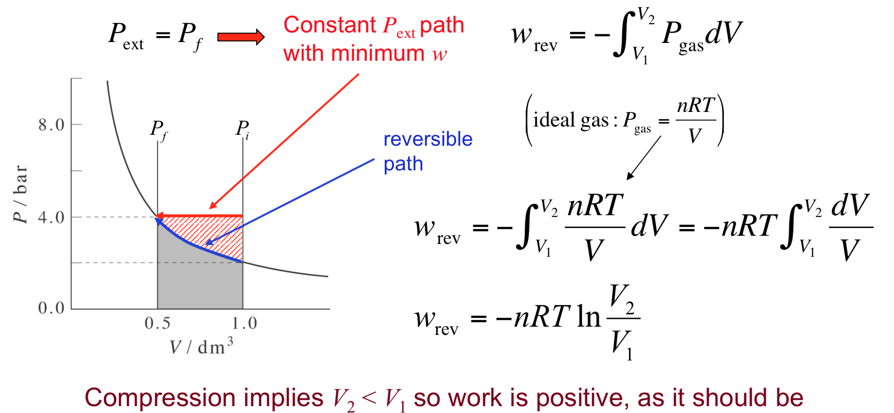
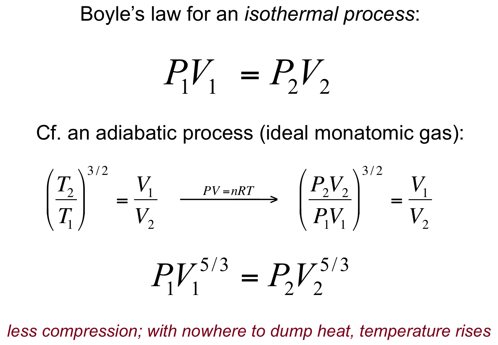
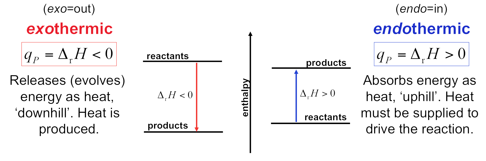

# Week 5

**First Law of Thermodynamics**

* Thermodynamics has at its foundation three fundamental laws
* Joule observes the equivalence between the energy from gravitational force turning to heat

* Relations between a thermodynamic system and its surroundings:

* Gas Expansion and Work:

---

**Paths of PV Work (means constant Temperature)**

* Considering work against gravity (first figure case). The general expression to describe the work is:

*
* Solving for the case which external pressure is constant:

* Consider an **isothermal compression** at constant temperature:

*
* It’s important to note that work depends on the path taken from V1 to V2
* For a compression, the minimum work is done along the reversible path, which means walk over PV curve
* In infinitesimally small steps, Pext is made infinitesimally larger than Pgas. Thus, at every step Pext is equal to the equilibrium gas pressure Pgas

* Considering an **isothermal expansion**:
*
* For an expansion, the maximum work is done on the surroundings along the reversible path

---

**Differentials and State Functions**

* State Functions:
*
* A state function is a property that depends only upon the state of the system
* That is, it is independent of how the system was brought to that state (independent of the path)
* Example: Energy

*
*
* Work and Heat are _**not**_ state function. They’re path functions:

* **The First Law of Thermodynamics**: Energy is conserved

---

**Characteristic Ideal Gas Expansion Paths**

* Examples of different processes with same ΔU:

* **Path A**: Reversible isothermal expansion

* **Path B**: Reversible adiabatic expansion

* **Path C**: Reversibly heat at constant volume

* **Path B + C**:

* **Paths D + E**:

* **Comparison of Paths**:

---

**Adiabatic Processes**

* **Quantitative Comparison of Paths**:

* Adiabatic expansion always cool a gas:

* Comparison between adiabatic and isothermal ideal gas law:

---

**Microscopic Origin of Pressure**

* Work and Heat:
*
* Starting from the expression to internal energy:

*
* Take the differentiate:

*
* Interpreting this comparison with dU:

*
*
* Differential work is small changes in energy levels with constant probabilities
* What pressure does in reducing a volume in a box, for example, that would split the energy apart, become more wider

*
* Defining **Pressure**:

---

**Enthalpy**

* Considering constant pressure conditions, for a reversible process where the work is restricted to PV work:

* At constant volume condition (V1=V2):

* And for constant pressure (more convenient to work in chemistry):

* In both cases (constant pressure and volume), heat is a state function. So, we define **Enthalpy**:

*
* At constant pressure:

* Enthalpy has the same role at constant pressure that internal energy has at constant volume!

* Comparing enthalpy and internal energy:

---

**Heat Capacities**

* **Heat Capacity** is a Path Function
*
* Defined as the amount of energy required to raise the temperature of a substance by one degree
* It’s different if done at constant V or constant P:

* Comparing Heat Capacities of an ideal gas:

* The difference in enthalpy at two different temperatures is determined from integration of CP over the temperature range (if there’s no phase transition):

*
* At a phase transition, there is no change in the temperature as you add heat (CP→∞), so one must also add any enthalpy associated with a phase change where needed. For example:

*
* Example of phase transition: Benzene

---

**Thermochemistry**

* **Heat of Reaction**: Heat involved in a chemical reaction
* At constant pressure, heat of reaction is given by:

* Different kinds of reactions according to ΔH signal:

*
* Reactions examples:

* Entalphy is a state function, which means it is an additive property (Hess Law)

---

**Standard Enthalpy**

* _ΔrH_ is extensive: its value depends on the number of moles of the reacting species
* To facilitate tabulation, IUPAC created the standard enthalpy of reaction, which is intensive, _ΔrH°_
*
* Implies one mole of a specified reagent and all reactants and products in their standard states at a given temperature

* The standard enthalpy of reaction to form one mole of a substance from its constituent elements in their naturally occurring elemental forms defines the intensive standard molar enthalpy of formation, _ΔfH°_

*  Values of _ΔfH°_ for pure elements in their most stable forms at one bar and the temperature of interest is set to _**zero**_

* Variation of _ΔrH°_ according to temperature:

