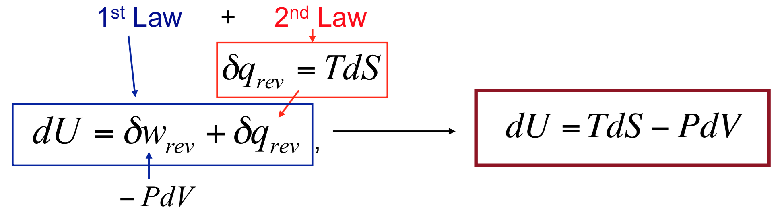

# Week 7

**Entropy and Other Thermodynamic Functions**

* Relations of differentials:

*
* Comparing with dS total differential expression, we have:

* Applying the same idea to dH:

* It’s possible obtain an expression for absolute entropy values:

**Third Law of Thermodynamics**

* Third Law of Thermodynamics:_ Every substance has a finite positive entropy, but at zero Kelvin the entropy may become 0, and it does so in the case of a perfectly crystalline substance_

* Thinking by molecular point-of-view:

**Standard Entropy**

* a
