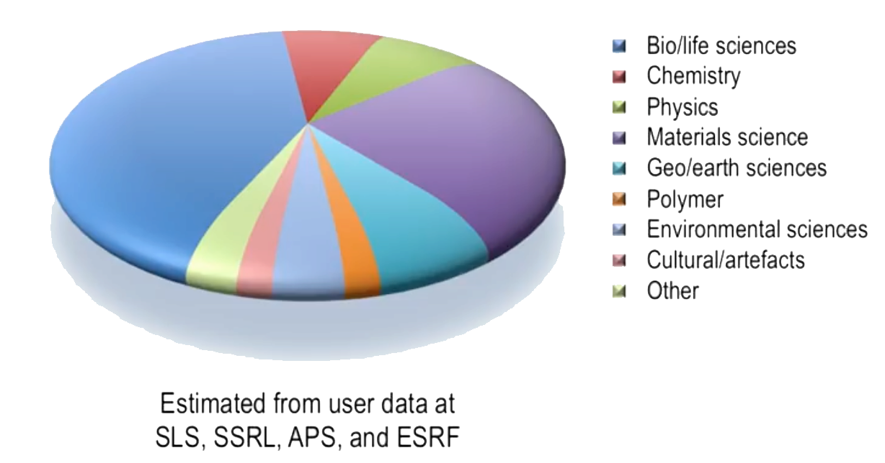

# Synchrotrons and X-Ray Free Electron Lasers
# Week 1: Introduction to x-rays and x-ray sources  
## Users of Synchrotrons And Their Impact on Society

**Synchrotrons** provide **intense sources of electromagnetic radiation** over broad ranges of wavelengths

- Typically spanning values marginally shorter than that of visible light (beginning at 100 nm in the ultraviolet vacuum regime) to hard x-rays with wavelengths that are one to two orders of magnitude shorter than typical chemical bond lengths;

- This kind of light sources has been used by different scientific areas:

|  |
|:--:|
| *Estimated from recent user data at some Light Sources.* |

**21 Nobel Prizes** given to X-Rays researches since 1901 when Wilhelm Röntgen discovers it.

### Comparison between Bremsstrahlung Radiation and Synchrotron Radiation

**Bremsstrahlung radiation** (German for *braking radiation*) occurs when a charged particle is **decelerated by collision** with another particle or an atom.

- The particle loses part or all of its kinetic energy, which is converted into high-energy gamma-ray photons to satisfy the law of conservation of energy;

**Synchrotron radiation** is caused by the emission of radiation from a charged particle **forced to execute a curved trajectory**

- The acceleration is centripetal and therefore at right-angles to the direction of motion.

In an electron storage ring of a synchrotron, the velocity of the electrons **remains nearly constant**, varying by only a tiny fraction of a percent;

- Conservation of energy demands that the electron energy do **become smaller due to the emission of light**. The RF cavity in a storage ring replenishes this lost energy;

## Basics Concepts of X-Rays

### X-Ray Regimes

**Soft X-rays**: begin after the visible and ultraviolet regime and cover a range of 100 nm down to 0.6 nm.

**Hard X-rays**: wavelengths shorter than 0.3 nm.

- Soft X-rays that in general interact much more strongly with matter than do hard X-rays;

**Tender X-Rays**: the transition between soft and hard x-rays is not abrupt and is anyway somewhat arbitrary, depending strongly on the material being irradiated, the concept of tender x-rays was introduced to bridge these two regimes.

|  |
|:--:|
| *X-Ray regimes in a photon energy scale.* |

### X-Ray Units
Normally, however, one characterizes x-rays by their photon energy *E* rather than their wavelength . The relationship between energy and wavelength is given by the Planck-Einstein relation:

- Where:
  -  is the Plank's constant;
  -  is the speed of light in vacuum;

In the hardest (the most energetic) x-rays used in synchrotron science (wavelengths of picometers), photon energies are of the order of  . Then, we use **electron-volts** as a unit of energy.

**1 Electron-Volt** () is the energy an electron gains if it is accelerated in a vacuum (no collisions) from a cathode plate to an anode plate which is  () more positive in potential;

Planck-Einstein equation in electron-volts and Angstroms:

The vacuum ultraviolet and soft x-rays produced at synchrotrons begin at  to  and continue up to approximately .

- Hard x-rays begin at ;
  - They are used in medicine and airports because of their vast penetration depths;
- Tender regime spans the gap between ;

Gray () is the **unit to describe absorption of x-rays**.

-  is equal to one Joule of absorbed radiation energy per kilogram;

### X-Ray Properties

X-rays are considered **"nondestructive" radiation**, because allows seeing the inner structure and composition of an object without the need to open or slice it.

Hard x-rays have wavelengths comparable to or shorter than **typical distances between atoms** (bond lengths). This property of hard x-rays makes them useful in **investigating the atomic structures of materials**.

- The shortest bond length is of the  molecule: ;
  - Bonds between heavy elements can exceed  ();
  -  x-radiation pass over carbon-carbon single, double, and triple bonds;

Hard x-rays have energies **similar to bonding energies of core electrons in atoms**.

- The hard x-ray regime can access all elements with atomic numbers above  (Calcium);
  - This property can be exploited in hard x-ray spectroscopies and also in crystallography, to solve structures;

|  |
|:--:|
| *The four most tightly bound electron shells as a function of Z, the atomic number from Z = 1 (hydrogen) to Z = 92 (uranium).* |

The lower photon energy of x-rays means that they interact primarily with light atoms and the **outer (valence) electrons of heavier atoms**. It can be used to investigate:

- Electronic properties of metals, semiconductors, and superconductors;
- The chemical composition of heterogeneous systems;
- Imaging of magnetic domains down to the nanometer scale;

## Synchrotrons and XFELs

**Synchrotron** is a very brilliant source of light or electromagnetic radiation.

|  |
|:--:|
| *Schematic of a synchrotron facility.* |

### Synchrotron components:

1) **Source of Electrons** (Electron Gun):

	- A heated metal filament ejecting electrons by thermionic
emission;

2) **LINAC** (evacuated linear accelerator):

	- Electrons are then accelerated over an ultrahigh vacuum conditions (pressures );

3) **Booster Ring**:

	- The energy of the electrons is further ramped up until they attain the design energy of the main “storage” ring;

4) **Storage Ring**:

	- Into which they are injected and where they are stored and are used to generate synchrotron radiation;
	- Electrons now have Giga-electronvolts of energy (relativistic speeds, exceedingly close to the speed of light);
	- The path of the electrons is controlled by **bending magnets**;
	- The straight sections between the bending magnets, **the insertion devices**, are used to insert alternating arrays of north-south, south-north magnet dipoles, are the more brilliant sources of synchrotron radiation;

5) **Beamlines**:

	- Tangential position to the BMs and IDs;
	- The place where we can use the synchrotron radiation;

### Desired properties of X-Ray Radiation

- Intense;
- Monochromatic achievable (relative spectral bandwidth);
- Parallel (horizontal and vertical beam divergences);
- Emanate from as small a source point as possible (source size);

**Brilliance** Formula:

- Where:
  -  is brilliance;
  -  is the number of photons;
  -  is the emittance in horizontal direction;
  -  is the emittance in vertical direction;
  -  corresponds to 0.1% of the bandwidth of the central wavelength (dimensionless)

|  |
|:--:|
| *Progress in X-Ray Brilliance, in comparison with the Moore's Law for computes.* |

The latest development in synchrotron technology has focussed on improving the brilliance **not by increasing the photon flux, but rather by reducing the source size and divergence
of the beam**.

- **Diffraction-limited storage rings** (DLSR) promise a further two orders of magnitude increase in brilliance compared to third-generation synchrotrons by using more bending magnets, each magnet forcing the electrons to turn through a smaller angle;

### X-Ray Free Electron Lasers (XFELs)

**X-ray free-electron lasers** are new sources of x-radiation, with peak brilliance approximately ten orders of magnitude higher still than modern synchrotrons.

They produce trains of pulses with durations between a range .

- This is over three orders of magnitude shorter than pulse lengths produced by synchrotrons, and **sufficiently short to follow chemical reactions as they occur in real-time**;

Synchrotrons and XFELs are thus **complementary** to one another.

#### How XFELs works?

|  |
|:--:|
| *X-Ray Free-Electron Laser Architecture.* |

1) A short electron bunch is generated by irradiating a metallic target with a femtosecond laser pulse;

2) This is accelerated in a LINAC and then undergoes one or more bunch compressions to make the pulse shorter by a factor of 100;

3) The shortened electron pulse is then accelerated along a long LINAC to several GeV energy;

4) Enters a long array of alternating north-south, south-north magnet dipoles, called "undulator";

	- This long magnet array is required to induce a phenomenon known as **self-amplified spontaneous emission** (SASE);
	- The result of SASE is that, after exiting the long ondulator magnet array, the electron bunch has been altered such that it is now **divided into microbunches**, each having a duration of only a few femtoseconds;
	- These bunches produce the femtosecond x-radiation characteristic of XFELs;

## Some Useful Notes

#### How to obtain the relative bandwidth from the absolute value?

|  |
|:--:|
| *Bandwidth illustration.* |

Absolute  is given by:

To obtain the relative bandwidth  from absolute values of frequencies ,  and :

So, for , we have:

Using energies instead of frequencies, the  is given by:

