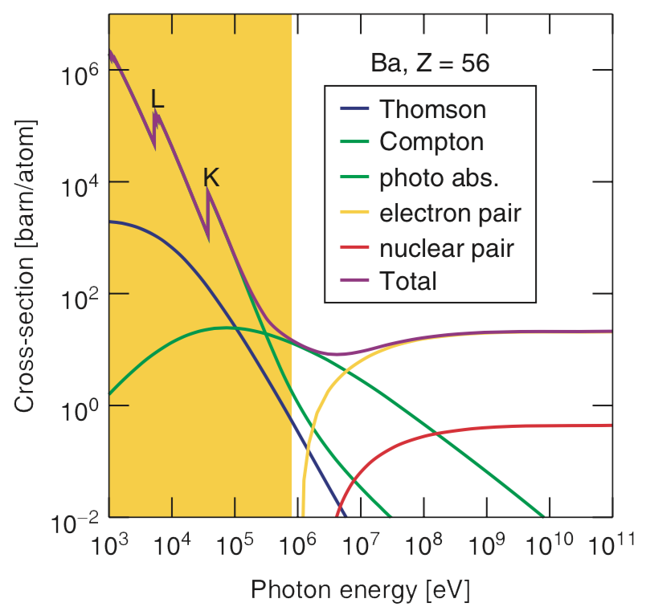

# Synchrotrons and X-Ray Free Electron Lasers
# Week 2: Interactions of x-rays with matter  

|  |
|:--:|
| *Some examples of interactions between radiation and matter.* |

## Cross sections
### Defining Cross Section and Attenuation Length

Considering a process , which occurs when **x-rays pass through a block of material** with the depth of  and the density of atoms  .

- Each atom has a cross-sectional area , associated with this process;

|  |
|:--:|
| *Schematic representation of Cross section.* |

**Cross section** is a quantity expressing the **likelihood** (*probability*)  **of an interaction event between two particles**.

- An excellent educational article about Cross Section can be found in the [Symmetry Magazine](https://www.symmetrymagazine.org/article/speak-physics-what-is-a-cross-section]);

Due to this process, the beam intensity will **exponentially decay** once the photons are removed or scattered from the beam when they travel through the medium.

**Attenuation Length** is the distance  into a material when the probability of a particle to absorbed has dropped to  (or ) and it's given by:

## Processes which can be studied by Synchrotron Radiation

|  |
|:--:|
| *Cross-sections for various processes involving the interaction of x-rays with matter, for the element barium (Ba)* |

Processes involving electrons (yellow region):

- Compton scattering;
- Thomson scattering;
- Photoabsorption;

The **nuclear core** can be entire **disregarded** due to its relatively very large mass.

## Compton Scattering

This is a quantum-mechanical effect in which some of the energy and momentum of an incident photon is transmitted to a free electron, resulting in **a change in its momentum**.

|  |
|:--:|
| *Representation of Compton Scattering* |

The energy lost by the inelastically scattered photon, results in an enlargement of the final wavelength . The radio between the energies before () and after () the scattering can be calculated by:

## Thomson Scattering

Thomson scattering is an elastic scattering of electrons with **no loss in photon energy**.

- The photon energy remains **invariant**:

- The direction (momentum) can change through an angle ;

|  |
|:--:|
| *Representation of Thomson Scattering* |

So, we can define the **Scattering Vector** like:

Scattering cross-section of a free electron (integrating over all angles of dipole radiation):

When the x-ray wavelength is **larger** than the atom size, the elastic scattering cross-section from an atom, which atomic number is given by , is **independent** the wavelength:

#### Atomic Scattering Factor ()

The precise drop-off is given by the atomic scattering factor, .

- Describes the elastic scattering amplitude as a function of **angle**, **wavelength**, and **atom type**;
-  is normally expressed as a function of  or :

### Forced Oscillator and Resonance

We can model the response of a bound electron to an incident electromagnetic field to that of a forced oscillator;

- If the driving frequency , the spring will remain stiff and the ball will **move in phase**;
- If , the spring will react instantaneously with the handle before the ball can respond, due to its inertia, and the motion will be **out of phase**;
- When the ball is driven at the natural frequency,   the system is said to be in **resonance** and will have a maximum amplitude;

|  |
|:--:|
| *Representation of Forced Oscillators: a ball on the end of a spring being forced to respond to an oscillatory driving force via a handle* |
|   |

An electron in an atom will respond similarly, so:

- We need to add a negative term  to  to represent the reduced response:

  - Generally, we have 
  - This reduction is most pronounced at resonance, where the photon energy equals the binding energy of the electron to the atom;
  - Reduces the amplitude of scattering due to damping because the electron is bound;

- We include absorption by another component , which **increases abruptly at resonance**;

  

- Where:
    - $f_2$ lags $f_1$ by 90 degrees, which is mathematically expressed by it being an imaginary term;
    - Out-of-phase re-emission after absorption at resonance;

The relationship between ** and Photoabsorption** is given by:

# Refraction

## Snell's Law

Describes the relationship between the angles of incidence and refraction, when referring to light or other waves passing through a boundary between two different isotropic media, with different refractive indexes .

- Visible light travels **more slowly** in a transparent medium than in vacuum, where ;

|  |
|:--:|
| *Representation of refraction when the light travels from a medium with refractive index  to other medium with .* |
|   |

The **critical angle for total internal reflection** (), which happens when travel between media with :

- Below this angle , **all light** impinging on the interface will be **reflected back** into the medium;

Using a Taylor expansion, we can get that:

Even at incident angles shallower than the critical angle, **the x-rays do penetrate a short distance into the reflecting surface** in an evanescent
wave.

- X-rays must interact at some level with the material to "perceive" that they will be reflected;

## The Complex Refractive index

- Where:
    - $n_R$ is the real part, related to the **refraction**;
    - $\delta$ is the Refractive-index decrement;
    - $n_I$ is the imaginary part, related to **absorption**;
    - $\beta$ is the absorption index;

It can be related to the Atomic Factor () by the following expression:

- Which can be rewritten in termos of  and , as:

- Then, we have, in terms of :

### About the values of the refraction indexes for X-Rays
It's possible to found  for x-rays. It **does not** means that they exceed the speed of light (i.e., Einstein's special relativity **remains inviolate**):

- This is referring to the phase velocity, the speed at which the peaks and troughs of the electromagnetic train move;
- The group velocity, however, which **is less than **, which
describes the propagation of energy or information, or here, the speed of the “packet” or envelope of light;

### Relationship between the refraction index and absorption

The exponential decay of intensity:

Then, we have the absorption length (in units of distance):

## Subsequent Processes of Photoabsorption

We consider four main products:

1) Photoelectron:

   - The promoted electron may reside in an unoccupied orbital if the photon energy;
   - Used in techniques like NEXAFS and XPS;

2) Fluorescence:

   - Results from the removal of a core electron and the relaxation of another "more external" one the "hole" left behind;
   - The energy of this process is released as a photon;
   - Most common for heavy elements;

3) Auger Emission:

   - Similar to fluorescence, but releases an electron, called **Auger electron**;
   - Auger processes tend to dominate for low atomic number atoms;
   - Its kinetic energy is independent of the incident photon energy;

4) Secondary electrons:

   - Any ejected electron will on average collide with other electrons after a certain characteristic distance;
