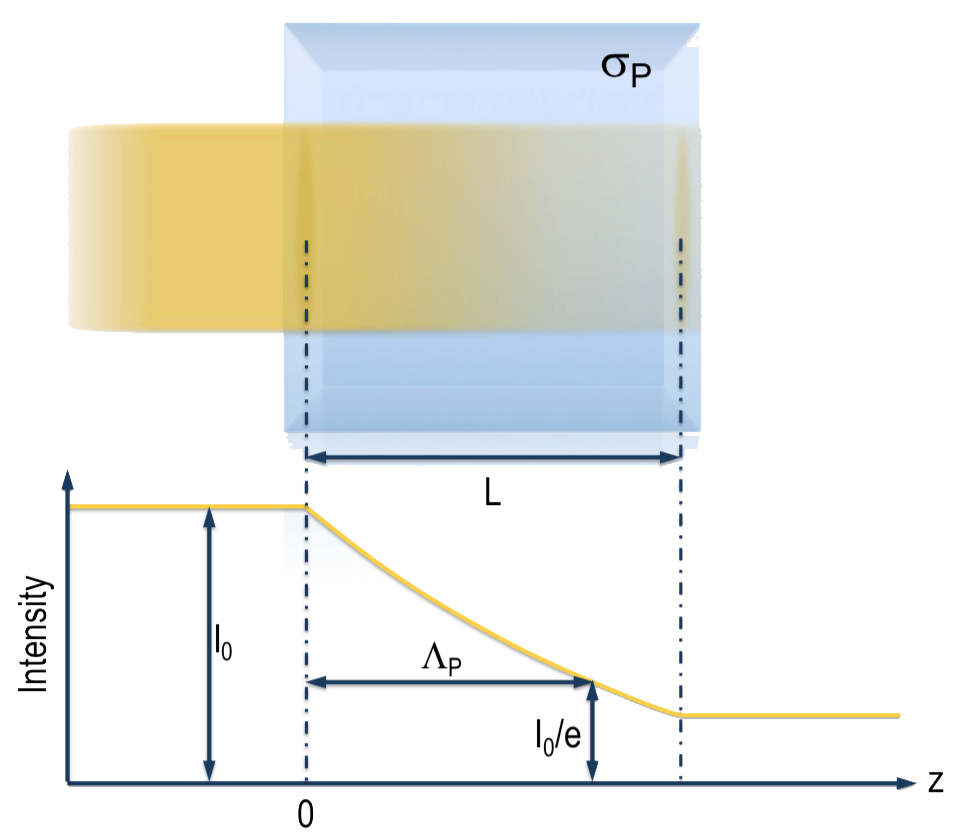
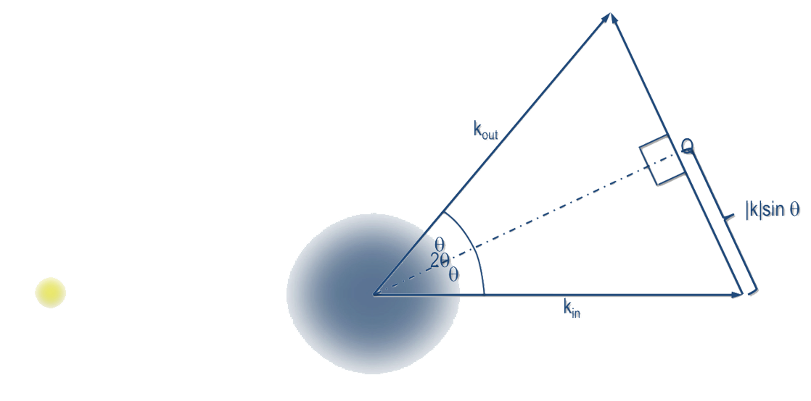
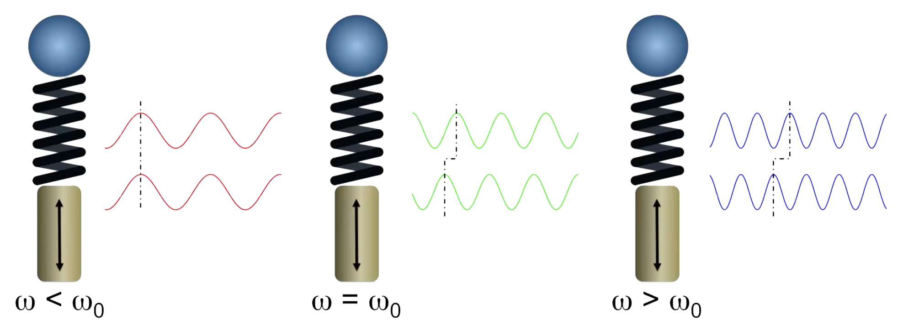

# Synchrotrons and X-Ray Free Electron Lasers
# Week 2: Interactions of x-rays with matter  

|  |
|:--:|
| *Some examples of interactions between radiation and matter.* |

## Cross sections
### Defining Cross Section and Attenuation Length

Considering a process $\mathrm{P}$, which occurs when **x-rays pass through a block of material** with the depth of $\mathrm{L}$ and the density of atoms  $\rho_a$.

- Each atom has a cross-sectional area $\sigma_\mathrm{P}$, associated with this process;

|  |
|:--:|
| *Schematic representation of Cross section.* |

**Cross section** is a quantity expressing the **likelihood** (*probability*)  **of an interaction event between two particles**.

- An excellent educational article about Cross Section can be found in the [Symmetry Magazine](https://www.symmetrymagazine.org/article/speak-physics-what-is-a-cross-section]);

Due to this process, the beam intensity will **exponentially decay** once the photons are removed or scattered from the beam when they travel through the medium.

**Attenuation Length** is the distance $\Lambda_\mathrm{P}$ into a material when the probability of a particle to absorbed has dropped to $\frac{1}{e}$ (or $\approx 63\%$) and it's given by:

$$\Lambda_\mathrm{P} = \frac{1}{\sigma_\mathrm{P} \rho_a}$$

## Processes which can be studied by Synchrotron Radiation

|  |
|:--:|
| *Cross-sections for various processes involving the interaction of x-rays with matter, for the element barium (Ba)* |

Processes involving electrons (yellow region):

- Compton scattering;
- Thomson scattering;
- Photoabsorption;

The **nuclear core** can be entire **disregarded** due to its relatively very large mass.

## Compton Scattering

This is a quantum-mechanical effect in which some of the energy and momentum of an incident photon is transmitted to a free electron, resulting in **a change in its momentum**.

|  |
|:--:|
| *Representation of Compton Scattering* |

The energy lost by the inelastically scattered photon, results in an enlargement of the final wavelength $\lambda$. The radio between the energies before ($E_0$) and after ($E$) the scattering can be calculated by:

$$\frac{E_0}{E} = \frac{\lambda}{\lambda_0} = 1 + \frac{h}{mc} k_0 (1- \cos{\psi})$$

## Thomson Scattering

Thomson scattering is an elastic scattering of electrons with **no loss in photon energy**.

- The photon energy remains **invariant**:

$$h\nu_{in} = h\nu_{out}$$

- The direction (momentum) can change through an angle $2\theta$;

|  |
|:--:|
| *Representation of Thomson Scattering* |

So, we can define the **Scattering Vector** like:

$$\vec{Q} = \vec{k_{in}} - \vec{k_{out}}$$

$$Q = 2k \sin{\theta} = \frac{4\pi}{\lambda} \sin{\theta}$$

Scattering cross-section of a free electron (integrating over all angles of dipole radiation):

$$\sigma_T = \left( \frac{8\pi}{3} \right) r_0^2 = 0.665 \; \mathrm{barn}$$

When the x-ray wavelength is **larger** than the atom size, the elastic scattering cross-section from an atom, which atomic number is given by $Z$, is **independent** the wavelength:
$$\sigma_Z = Z^2 \sigma_T$$

#### Atomic Scattering Factor ($f$)

The precise drop-off is given by the atomic scattering factor, $f$.

- Describes the elastic scattering amplitude as a function of **angle**, **wavelength**, and **atom type**;
- $f$ is normally expressed as a function of $Q$ or $\frac{\sin{\theta}}{\lambda}$:

$$f^0 \left( \frac{\sin{\theta}}{\lambda} \right) = \sum^4_{i=1} a_i \, \mathrm{e}^{-b_i \frac{\sin^2{\theta}}{\lambda^2}} + c$$

### Forced Oscillator and Resonance

We can model the response of a bound electron to an incident electromagnetic field to that of a forced oscillator;

- If the driving frequency $\omega < \omega_0$, the spring will remain stiff and the ball will **move in phase**;
- If $\omega > \omega_0$, the spring will react instantaneously with the handle before the ball can respond, due to its inertia, and the motion will be **out of phase**;
- When the ball is driven at the natural frequency,  $\omega = \omega_0$ the system is said to be in **resonance** and will have a maximum amplitude;

|  |
|:--:|
| *Representation of Forced Oscillators: a ball on the end of a spring being forced to respond to an oscillatory driving force via a handle* |
|   |

An electron in an atom will respond similarly, so:

- We need to add a negative term $f'$ to $f_0$ to represent the reduced response:

$$f_1(Q,\hbar\omega) = f_0 (Q) + f'(\hbar\omega)$$

  - Generally, we have $f_1 < f_0$
  - This reduction is most pronounced at resonance, where the photon energy equals the binding energy of the electron to the atom;
  - Reduces the amplitude of scattering due to damping because the electron is bound;

- We include absorption by another component $f_2$, which **increases abruptly at resonance**;

  $$f(Q,\hbar\omega) = f_1 (Q,\hbar\omega) + i f_2(\hbar\omega)$$

- Where:
    - $f_2$ lags $f_1$ by 90 degrees, which is mathematically expressed by it being an imaginary term;
    - Out-of-phase re-emission after absorption at resonance;

The relationship between **$f_2$ and Photoabsorption** is given by:

$$f_2 = \frac{\sigma_{PA}}{2\lambda r_0}$$

# Refraction

## Snell's Law

Describes the relationship between the angles of incidence and refraction, when referring to light or other waves passing through a boundary between two different isotropic media, with different refractive indexes $n_R$.

$$\frac{\cos{\alpha}}{\cos{\alpha'}} = \frac{n_{R'}}{n_R}$$

- Visible light travels **more slowly** in a transparent medium than in vacuum, where $n_R=0$;

|  |
|:--:|
| *Representation of refraction when the light travels from a medium with refractive index $n_R$ to other medium with $n_{R'}$.* |
|   |

The **critical angle for total internal reflection** ($\alpha_c$), which happens when travel between media with $n_R > n_{R'}$:

$$\cos{\alpha_c} = \frac{1}{n_{R}}$$

- Below this angle $\alpha_c$, **all light** impinging on the interface will be **reflected back** into the medium;

Using a Taylor expansion, we can get that:
$$\alpha_c \approx \sqrt{2\delta} \; [\mathrm{rad}]$$

Even at incident angles shallower than the critical angle, **the x-rays do penetrate a short distance into the reflecting surface** in an evanescent
wave.

- X-rays must interact at some level with the material to "perceive" that they will be reflected;

## The Complex Refractive index

$$n = n_R + i n_I = (1 - \delta) + i\beta$$

- Where:
    - $n_R$ is the real part, related to the **refraction**;
    - $\delta$ is the Refractive-index decrement;
    - $n_I$ is the imaginary part, related to **absorption**;
    - $\beta$ is the absorption index;

It can be related to the Atomic Factor ($f$) by the following expression:

$$n = 1 - \frac{r_0}{2 \pi} \lambda^2 \sum_i N_i f_i(0)$$

- Which can be rewritten in termos of $f_1$ and $f_2$, as:

$$n = 1 - \frac{r_0}{2\pi} \lambda^2 \sum_i N_i f_{1i}(0) - i  \frac{r_0}{2\pi} \lambda^2 \sum_i N_i f_{2i}(0)$$

- Then, we have, in terms of $\delta$:

$$\delta = \frac{\rho \, r_0 \lambda^2}{2\pi}$$

### About the values of the refraction indexes for X-Rays
It's possible to found $n < 1$ for x-rays. It **does not** means that they exceed the speed of light (i.e., Einstein's special relativity **remains inviolate**):

- This is referring to the phase velocity, the speed at which the peaks and troughs of the electromagnetic train move;
- The group velocity, however, which **is less than $c$**, which
describes the propagation of energy or information, or here, the speed of the “packet” or envelope of light;

### Relationship between the refraction index and absorption

The exponential decay of intensity:
$$\frac{I}{I_0} = e^{- 2 n_I k_0 z} = e^{- \mu z}$$

Then, we have the absorption length (in units of distance):
$$\Lambda = \frac{1}{\mu} = \frac{1}{2 n_I k_0}$$

## Subsequent Processes of Photoabsorption

We consider four main products:

1) Photoelectron:

   - The promoted electron may reside in an unoccupied orbital if the photon energy;
   - Used in techniques like NEXAFS and XPS;

2) Fluorescence:

   - Results from the removal of a core electron and the relaxation of another "more external" one the "hole" left behind;
   - The energy of this process is released as a photon;
   - Most common for heavy elements;

3) Auger Emission:

   - Similar to fluorescence, but releases an electron, called **Auger electron**;
   - Auger processes tend to dominate for low atomic number atoms;
   - Its kinetic energy is independent of the incident photon energy;

4) Secondary electrons:

   - Any ejected electron will on average collide with other electrons after a certain characteristic distance;
