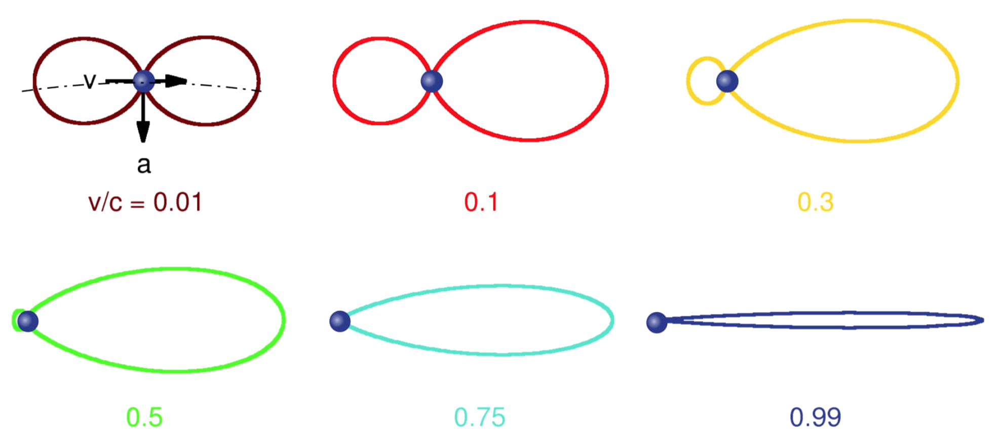

# Synchrotrons and X-Ray Free Electron Lasers
# Week 3: Basics of Machine Physics - Part I

## Electromagnetic Waves

Electromagnetic radiation is a perpendicular transverse wave.

- The square of the classical amplitude is proportional to the intensity, but the photon energy is independent of the amplitude;
  - It is **directly proportional to the frequency**;
- All electromagnetic radiation has the same speed in vacuum, but **not** the same velocity
  - Velocity is a vector quantity which includes both a **magnitude and direction**; not all EM waves travel in the same direction.

A linearly polarized electromagnetic plane wave propagating in the positive z-direction have its magnetic-field vector always rotated $\pi/2$ (90 degrees) clockwise relative to the electric-field vector.

|  |
|:--:|
| *Pictorial representation of an electromagnetic field.* |

The force of an electric field on an electron ($F_E$):
$$
F_E = -eE
$$

- Where:
  - $e$ is the elementary charge;
  - $E$ is the electric field amplitude;

The force imparted by an electric field on an electron **always acts perpendicular** to the direction of propagation and in the opposite direction of the electric-field vector.

The conventional current is **opposite** in direction to the electron
motion.

The positive direction of the magnetic field is defined as being from
the north to south pole;

- Bending magnets in synchrotron facilities in which the electrons
circulate in a clockwise sense will have the north poles above the
south poles;

The magnetic Lorentz force ($F_L$) is given by:
$$
F_L = eBv
$$

- Where:
  - $B$ is the magnetic field amplitude;
  - $v$ is the electron velocity;

From the classical electromagnetic theory, we have the relationship between $E$ and $B$:
$$
B = \frac{E}{c}
$$

Using this expression, we can found the ratio between $F_L$ and $F_E$:
$$
\frac{F_L}{F_E} = - \frac{v}{c}
$$

## Why do accelerated charged particle emits light?

Consider the electrostatic magnetic field radiated out from an electron in all directions and at the speed of light.

As electromagnetic radiation is a transverse wave (i.e. perpendicular)
to the direction of motion, an observer will **never** see light emitted
from a stationary electron. The same can be demonstrated to an electron moving at a constant velocity.

If an electron bounces off a wall (i.e. it is decelerated and accelerated), the observer will see the electric field when it hits the wall.

- At this moment, there will be an abrupt lateral shift in the electric-field
lines and the observer sees a lateral component in the electric fields;
  - It is a synonymous of the **generation of light**;

**Important**: The light generated by acceleration of charged particles has **zero intensity** in the direction of that acceleration.

If the electron bounces off repeatedly back and forth in two walls, the resultant field will include abrupt lateral components (i.e. light) that appear after each bounce.

Now, if instead of the electron moving with constant speed between two walls, we drive it sinusoidally, the resulting electric field will have the **same frequency** and thus mimic the driving acceleration.

- If the driving acceleration of the electron is itself caused by the electric field component of light, the electron will re-emit light at
exactly the same frequency;
  - This is identical to the elastic, or Thomson, scattering of light by electrons;

### How would the emitted radiation from an electron executing a circular path look like?

The acceleration is towards the centre of the circle, hence the symmetry axis of the “horn torus” form of the dipole radiation also lies in this direction.

- This **doesn’t** seem to look much like the pencil-like radiation distribution associated with synchrotron light;
  - It happens because we are not including the relativity of the typical energies of electrons in the storage rings;

|  |
|:--:|
| *Storage-rings energies for the electrons and their generated photons.* |

In this graph, a selection of synchrotron facilities has been chosen that cover the typical range of electron energies. These span about 2 to 8 GeV, and **provides photon energies over almost 5 orders of magnitude**, from ultraviolet photons at 10 eV to almost 1 MeV.

Because we know the speed of light is Nature’s ultimate speed limit, it’s clear
we need to apply **relativity**. The relationship between the electrons’ relativistic kinetic energy (given by the storage-ring energy) and the velocity is given:
$$
\epsilon = \frac{mc^2}{\sqrt{1-(v/c)^2}}
$$

An important parameter is the gamma ($\gamma$), defined as the ratio between the electrons' kinetic energy and the rest mass energy of the electron:
$$
\gamma = \frac{\epsilon}{mc^2} = 1957 \epsilon [\mathrm{GeV}]
$$
And $\beta$, which is the ratio between the electron speed and the speed of light:
$$
\beta = \frac{v}{c} = \sqrt{1 - \frac{1}{\gamma^2}}
$$

Using a Taylor series, it's possible to obtain this approximation:
$$
\beta \approx 1 - \frac{1}{2\gamma^2}
$$

At relativistic speed, **the electron mass grows** in a order of $\gamma m$ for a stationary observer, and the space becomes distorted.

|  |
|:--:|
| *Pictorial representation of spatial distribution of synchrotron light.* |

The angular range of radiation scales is $1/\gamma$. Even for medium-energy storage rings, the opening angle in both the horizontal and vertical planes is of the order of $1/5000$ of a radian. This means that, for a point source, the beam will have a lateral extent of approximately 4 mm at a distance of 20 m - **synchrotron radiation is very collimated**.

---

## Centripetal Forces

In the storage ring, the centripetal acceleration is given by:
$$
a = \frac{v^2}{\rho} \approx \frac{c^2}{\rho}
$$

So, the force is given by:
$$
F = \gamma \frac{mc^2}{\rho}
$$

Electric fields as a steering mechanism is **impossibly hazardous**. Then, we use magnetic fields.

The bending radius $\rho$ is given by:
$$
\rho = \gamma \frac{mc}{eB} = \frac{E}{ceB}
$$

$$
\rho [\mathrm{m}] = 3.3  \frac{\epsilon}{B} \frac{[\mathrm{GeV}]}{[\mathrm{T}]}
$$

## Bending-Magnets Radiation

The spectrum and intensity of bending-magnet radiation depends on several parameters.

Considering the orbit's circumference as perfectly circular, the angular frequency in a storage ring is given by:
$$
\omega_0 = \frac{c}{\rho} \approx 3 \times 10^7 [\mathrm{rad/s}]
$$

And the critical frequency (a value associated with the synchrotron-radiation spectrum):
$$
\omega_c = \frac{3}{2} \gamma^3 \omega_0 = \frac{3}{2} \gamma^3 \frac{c}{\rho} = \frac{3}{2} \gamma^3 \frac{eB}{m} \approx 10^{19} [\mathrm{rad/s}]
$$

- The critical energy is linearly proportional to $B$ and varies with the square of the storage-ring energy;

$$
\hbar \omega_c [\mathrm{keV}] = 0.665 \epsilon^2 [\mathrm{GeV}] B [\mathrm{T}]
$$

Imagine an observer of the electron tangential to the bending magnet. From her perspective, the electron is first moving along the straight section upstream of the bending magnet with constant velocity - **it is not being accelerated, so we should not expect her to see any radiation**. But once the electron enters the gap between the dipole of the bending magnet, it experiences
a pulse of centripetal acceleration towards the centre of the ring due to the magnetic field. This “pulse” of acceleration cannot be described by a single frequency, but instead is composed of a continuous spectrum of frequencies, and the electron will emit this in response.

|  |
|:--:|
| *Bending-magnet spectra in different storage-rings.* |

**High-energy storage rings easily access high critical energies** on account of the square dependence on the storage-ring energy.

- It turns out that half of the integrated radiative power produced by a bending magnet lies below the critical energy, and half above;

### Radiation power by bending Magnets

The total integrated radiative power output of a bending magnet is given by:
$$
P [\mathrm{kW}] = 1.266 \epsilon^2 [\mathrm{GeV}] B^2 [\mathrm{T}] L [\mathrm{m}] I [\mathrm{A}]
$$

- Where $L$ is the length of the electron path passing between the magnet poles;

## Stored Energy and Power in the Storage Ring

The stored energy is their kinetic energy $E$, or storage-ring energy, multiplied by the number of electrons within the ring at any one time:
$$
E \times I = 3 \times 10^9 \mathrm{eV} \times 0.4 \mathrm{A} = 1.2 \times 10^9 \mathrm{W} (1.2 \mathrm{GW})
$$

### Power loss through radiation

The power loss through radiation is relatively slow, as the radiative power is four orders of magnitude smaller than the stored power. However, it
**only requires a small deviation** from the nominal storage-ring energy for an electron to enter an unstable and open orbit, and crash into the walls of the vacuum chamber making up the storage ring.

- The electrons require a steady replenishment of this lost energy;

#### The Radio-frequency Cavity (RF)

It runs fews hundreds of megahertz.

The electron entering the cavity when the field points maximally in the upstream direction will cause the electron to be maximally accelerated.

A very particular time window of the RF cycle is suited to bringing the electrons back to the nominal storage-ring energy. As a consequence, the electron current in a synchrotron is not continuous, but instead is composed of bunches, each separated by 1/f, the period of the RF cycle.

|  |
|:--:|
| *Representation of RF cavity in Storage Rings.* |

The number of electrons within any one bunch is equal to the current divided by the product of the RF frequency and  the elementary charge:
$$
\frac{I}{fe} = 5 \times 10^9 \; \mathrm{electrons}
$$

### Summary

- Only a magnetic Lorentz force is a reasonable way of steering electrons into a closed path in a storage ring;

- The characteristic, or critical frequency $\omega_c$ and energy $E_c$ were determined and shown to depend on the square of the storage-ring energy and linearly with the bending-magnet field strength;

- The radiative power generated by bending magnets and thus by the whole storage ring (excluding other components such as insertion devices) was determined and shown to be a small fraction of the power stored within the ring;

- Losses associated with radiation production need to be replenished, and the mechanism by which this is done, namely the use of a radio-frequency cavity, results in the electron current separating out into bunches with bunch durations two orders of magnitude shorter than their separation;