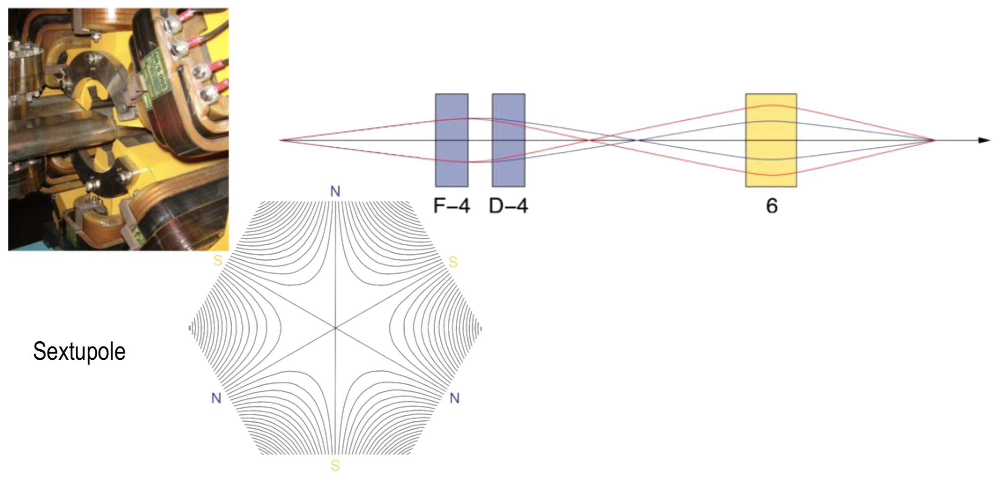
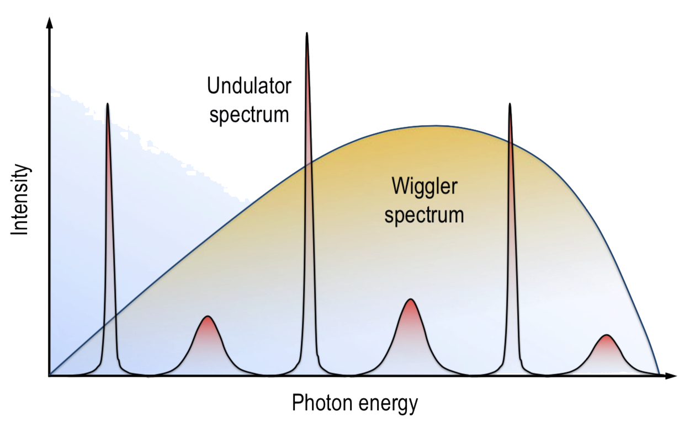
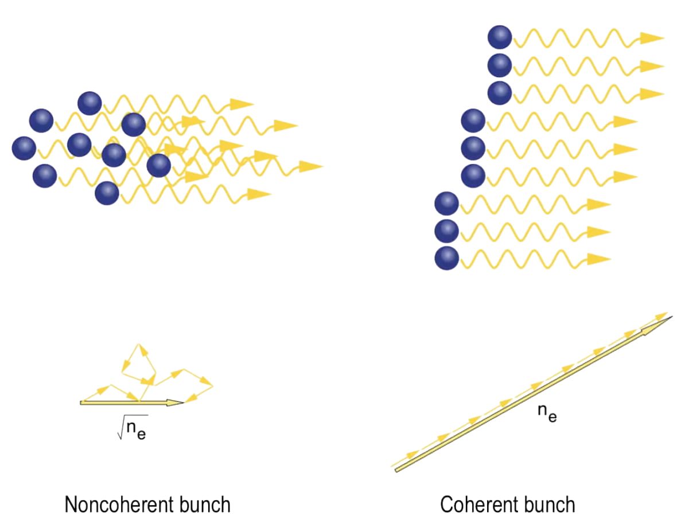

# Synchrotrons and X-Ray Free Electron Lasers
# Week 4: Basics of Machine Physics - Part II

## Important factors of a Light Source

### Flux

The flux associated with an x-ray source is simply the number of photons it emits for a standardized relative spectral bandwidth:
$$
\mathrm{Flux} = \frac{E}{\Delta E} \left[ \frac{\mathrm{Photons/s}}{0.1\% \mathrm{BW}} \right]
$$

Where:

- $\Delta E$ is a range of energies around a central energy $E$;

### Brilliance

The brilliance is simply the flux divided by the source size in units of area, and also by the divergence in the two orthogonal planes perpendicular to the beam axis.

$$
\mathrm{Brilliance} = \frac{\mathrm{Flux}}{\mathrm{Emittance}}
$$

### Emittance

The product of the divergence in the two orthogonal planes perpendicular to the beam axis, given in units, that is, **the source size and divergence**, is
known as the emittance.

$$
\epsilon_{x,y} = \sigma_{x,y} \sigma_{x,y}'
$$

|  |
|:--:|
| *Pictorial representation of emittance in terms of standard deviation.* |

#### Contributions of Electrons and Photons in the emittance

Because the sources are independent of each other, their contributions add orthogonally, as given by the following equations:
$$
\sigma_{x,y} = \sqrt{(\sigma^e_{x,y})^2 (\sigma^p)^2}
$$
$$
\sigma'_{x,y} = \sqrt{(\sigma'^e_{x,y})^2 (\sigma'^p)^2}
$$

##### Photon emittance

For photons, the standard deviation is given by:
$$
\sigma^p = \frac{1}{2\pi} \sqrt{\frac{\lambda L}{2}}
$$
$$
\sigma'^p = \sqrt{\frac{\lambda}{2L}}
$$

So, the emittance is:
$$
\epsilon^p = \sigma^p \sigma'^p = \frac{\lambda}{4\pi}
$$

Several facilities can now say that the magnet alignment has been so perfectly tuned that the vertical total emittance is essentially equal to the theoretical minimum (given by Heisenberg's principle).

### If a storage ring has a given emittance, how can this be “expressed”?

As the emittance is the product of the source size and divergence, we can either sacrifice source size for a very parallel beam, or vice versa, squeezing the source size to be as small as possible, and accepting a larger divergence.

|  |
|:--:|
| *Small source or small divergence?* |

A large beta function $\beta$ corresponds to a large source emitting parallel radiation, while as small beta describes a small but divergent source:

$$
\beta_{x,y} = \sigma_{x,y}/\sigma_{x,y}'
$$

For example, along the parts of the ring which contain the straights (to accommodate insertion devices), the beta functions are minimised in order to bring the electrons exactly to the centre of the insertion devices for optimal operation.

### Typical Values in a third-generator light source

- Undulator @ $3^{\mathrm{rd}}$ generation
- Flux $\approx 10^{14} \mathrm{ph}/\mathrm{s}/0.1\% \mathrm{BW}$
- Horizontal $\epsilon_x \approx 0.01 \; \mathrm{mm} \; \mathrm{rad}$
- Vertical $\epsilon_x \approx 10^{-4} \; \mathrm{mm} \; \mathrm{rad}$
- Brilliance $\approx 10^{14}/10^{-6} \mathrm{mm}^2 \; \mathrm{mrad}^2 \approx 10^{20} \mathrm{ph}/\mathrm{s}/(0.1\% \mathrm{BW} \; \mathrm{mm}^2 \; \mathrm{mrad}^2)$

## Coherence

Coherence describes the relative phase relationship between different parts of the x-ray source, or, from a quantum mechanical viewpoint, of the photons.

A source is said to be coherent if **the emitted waves are all in phase** and (by necessity) have the same wavelength.

- Lasers have a very high degree of coherence;
- Synchrotron sources are only partially coherent;
  - “coherent fraction” less than $0.1\%$ for hard x-rays;

In optical techniques (like microscopy), the size of the object that can be measured depends on the degree of coherence;

- X-ray diffraction is concerned with objects of the order of a few Angstroms to a couple of tens of nanometers (the unit cell size);
- In the case of coherent x-ray diffractive imaging of an object of characteristic dimensions measured in microns, we must take careful measures to ensure the beam is coherent enough that the scattered signal (called “speckle”) contains the required information to regain the sample’s structure;

### Types of Coherence

The coherent volume is spanned by two transverse and one longitudinal coherence length, resulting in a coherent volume.

- The transverse coherence lengths are determined by the divergence of the beam;
- The longitudinal value depends on the monochromacity of the beam;

#### Longitudinal Coherence Length

The longitudinal coherence length is defined as the length required for parts of the beam with different wavelengths (or energies) that begin in phase to be entirely out of phase and then in phase once more.

|  |
|:--:|
| *Longitudinal coherence features.* |

#### Transverse Coherence Length

The transverse coherence length is determined similarly as the lateral distance between parts of the wavefront separated by a phase of $2\pi$, due to the source divergence.

- The more parallel the beam (small Delta theta), the larger the transverse coherence;

|  |
|:--:|
| *Transverse coherence features.* |

Beamlines constructed for scattering experiments of mesoscopically sized objects, such as in SAXS, CXDI, and ptychography, tend to have long source - end-station distances $R$ and small source sizes $D$.

### The impact of imperfect optics

The wavefront can be further scrambled by imperfect optics, such as for specular reflections off an x-ray mirror, caused by that mirror not being perfectly flat. Beamlines exploiting coherence take great care in minimizing it.

### The Coeherent Fraction of a Light Source

The coherent fraction as a function of the electrons' and photons' source
sizes and divergences is given by:

$$
f_{coh} = \left( \left[ 1 + \left(\frac{\sigma^e_x}{\sigma^p}\right)^2 \right] \left[ 1 + \left(\frac{\sigma'^e_x}{\sigma'^p}\right)^2 \right] \left[ 1 + \left(\frac{\sigma^e_y}{\sigma^p}\right)^2 \right] \left[ 1 + \left(\frac{\sigma'^e_y}{\sigma'^p}\right)^2 \right] \right)^{-1/2}
$$

- In third generation light sources, the coherent fractions of the order of $10^{-3}$ or less are typical;

- Next-generation storage rings, DLSRs, promise to make a quantum leap in this direction, obtaining coherent fractions of a few percent, that is almost two orders of magnitude greater than presently possible;

- In the case of XFELs, the electron emittance is significantly smaller than the photon emittance, and coherent fractions close to unity are achieved;

---

## Magnetic Lattice

The **magnetic lattice** is responsible for keeping the electron beam on a closed orbit, including focusing it and chromatically correcting for electrons of slightly different kinetic energies.

|  |
|:--:|
| *Examples of Magnetic Lattices in different generations of Light Sources.* |

Typically, bending magnets come in pairs in a given arc-section of the storage ring. At third-generation facilities, they comes in triplets. In DLSRs, they come in clusters of five, seven or even nine in an arc section of the ring.

The Focusing Quadrupole Magnet (FQM) acts to reduce the energy losses by electron spreads in bending magnets.

|  |
|:--:|
| *Double-bending achromats system.* |

The magnet lattice design and its optimization therefore largely determine the horizontal emittance of the facility.

### Quadrupoles

Quadrupoles are the central element in bending magnets.

Deviations in the electrons’ position up or down from the central plane will cause them to **experience a restoring force** to the centre (refocussed).

|  |
|:--:|
| *Representation of electromagnetic fields in a Focusing quadrupole magnet (FQM).* |

By the correct placement of a FQM (F-4) and a DQM (D-4) after each other, the electron beam can be **focussed both vertically and horizontally**, though at different positions along the central axis, according to the electrons’ energy.

This longitudinal dispersion can be subsequently **chromatically corrected using sextupole magnets**, which have focal lengths that are inversely proportional to the distance of the electrons from the central axis.

|  |
|:--:|
| *Representation of the FQM and DQM combination and the sextupole system.* |

## Insertion devices

Insertion devices are sources of synchrotron radiation consisting of arrays of alternating N-S, S-N dipoles placed at the straight sections of the storage rings.

There are two sorts of insertion devices: the **wiggler** and the **undulator**.

|  |
|:--:|
| *Examples of Insertion Devices.* |

The parameter that best distinguishes undulators from wigglers is the so-called $K$ parameter. This expresses the ratio between the maximum angular excursion of the electrons due to the magnet array, $\phi_{max}$, to the natural opening angle of the synchrotron radiation, $1/\gamma$:
$$
K = \phi_{max} \gamma = \frac{e B_0}{mck_{u,w}} = 0.934 \lambda_{u,w} [\mathrm{cm}] B_0 [\mathrm{T}]
$$

- For **wigglers**:
  - $\lambda_w \approx 50 - 200 \mathrm{mm}$
  - $K \approx 10 - 40$
- For **undulators**:
  - $\lambda_u \approx 10 - 200 \mathrm{mm}$
  - $K \approx 0.5 - 3$

### Wigglers

The spectral features of wigglers are essentially the same as from a bending magnet:

  - The spectra are broadband, although the flux is larger because of the 2N poles;

**Thermal management** of this is therefore **critical** in order to avoid optical elements downstream of the wiggler at the beamline being destroyed.

### Undulators

Undulators have a very different spectra when comparing with wigglers.

|  |
|:--:|
| *Comparison between the spectra of undulators and wigglers.* |

The reduction in $K$ means that the emission lobes with natural opening angle $+/- 1/\gamma$ will now overlap. This overlap means that they interfere with one another, and consequently **only certain wavelengths will interfere constructively**.

The condition to obtain this constructive interference is given by:
$$
n\lambda_n = \frac{\lambda_u}{2\gamma^2} \left( 1 + \frac{K^2}{2} \right) = \frac{13.056 \lambda_u}{\epsilon^2} \frac{[\mathrm{cm}]}{[\mathrm{GeV}]} \left( 1 + \frac{K^2}{2} \right)
$$

$$
E_n [\mathrm{KeV}] = 0.95 \frac{n\epsilon^2}{(1+K^2/2)\lambda_u} \frac{[\mathrm{GeV}]}{[\mathrm{cm}]}
$$

We therefore need only to adjust the **gap size** so that the spectrum contracts along the energy axis until a spectral maximum lies at our energy (or wavelength) of interest.

Undulators are therefore tuned by varying the gap between the poles of the magnet array.

|  |
|:--:|
| *Variation of photon energy when changing the gap size of undulators.* |

The spectrally integrated power from undulators is much less than that from wigglers, by an order of magnitude, while their peak intensities are generally significantly higher.

Undulators are, at about $10^{-4}$, therefore approximately 100 times more efficient than wigglers and pose a **less severe problem with thermal management**, though this can still be significant if one considers that the beam divergence is much smaller, hence the areal power density on the first optical elements before monochromatization can be higher.

The brilliance of undulators is approximately $10^{18} - 10^{21} ph/s/mm^2/mrad^2/0.1\%\mathrm{BW}$, three orders of magnitude larger than for wigglers.

#### APPLE Undulators

The polarisation of the light produced by undulators can be adjusted so that any desired polarisation can be achieved regarding both its angle around the emission axis and its degree of ellipticity, between linear and fully circular. This is achieved using a so-called Advanced Planar Polarized Light Emmiter: **APPLE undulator**.

---

## Diffraction-Limited Storage Rings (DLSRs)

Diffraction-limited storage rings represent the **next refinement in synchrotron performance**, the “fourth generation” facilities.

- It is a significant improvement in the horizontal emittance;

A cursory glance at the equation describing the horizontal emittance of DBAs should provide a clue as to how we might achieve this:
$$
\epsilon^e_{x,\mathrm{DBA}} = C_{DBA} \gamma^2 \theta^3
$$

**Solution**: Reduce $\theta$ and use more BMs!

- Miniaturization possible due to:
  - Computer numerical control of machining;
  - Improved vacuum technology (NEGs);

### Advantages of DLSRs

- Low emittance:
  - $\sigma \sigma'$ improves by 1-2 orders of magnitude;
  - Small source size $\sigma$:
    - Good for scanning techniques (STXM, scanning XAS, XRF);
- Low divergence:
  - Good coherence for XPCS and ptychography;
  - Reduced optics size for horizontal focussing;
- Combination:
  - Large working distance for given focal spot size;
  - Focus on sample and detector;

## X-Ray Free-Electron Lasers

XFELs are defined by **their exceedingly high peak brilliance**, some $10^9$ or even $10^10$ times that achievable using synchrotrons.

The pulse produced by XFELs are **very short**, typically between a femtosecond and $100$ fs.

### What is the motivation for the construction of XFELs?

While X-rays provide atomic resolution, synchrotrons has the temporal resolution limited to a few tens of picoseconds. However, many physical and chemical processes occurs on femtoseconds scale.

So, XFELs combine the spatial resolution of x-rays with a temporal resolution down to the fs-scale, previously only possible using lasers in the visible, or near visible regime.

### XFELs vs. Synchrotrons

|  |
|:--:|
| *Comparison table between XFELs and Synchrotrons facilities.* |

### XFEL Archtecture: The Low Emittance Gun

Electron bunches are produced by irradiating a semiconductor or metallic surface with a femtosecond laser to produce photoemission.

The timing of this laser pulse is so chosen that the resulting electron cloud is then **accelerated by an RF cavity**, which reduces the impact on the emittance of space-charge effects.

The emittance emerging from this system is of the order of magnitude of $1 \mathrm{mm.mrad}$ in both transverse directions, while the peak current is approximately $50 \mathrm{A}$.

#### SASE Effect

**Bunch compressors** are used to induce SASE, the process responsible for the formation of the high-intensity femtosecond x-ray pulses.

The consequence of these unequal forces in bunch compressors is that the electrons begin to be bunched together to form microbunches, separated by a distance equal to the wavelength of the light they generate and are bathed in. Each microbunch therefore has a duration of a few femtoseconds to a few tens of femtoseconds.

As the microbunches begin to form, the electrons become more squeezed together, resulting in an increase in the instantaneous current. This produces a intenser undulator radiation, which in turn acts more strongly on the electrons, further enhancing the micro bunching process. This runaway effect is called **SASE** - Self-Amplified Spontaneous Emission.

|  |
|:--:|
| *Self-Amplified Spontaneos Emission microbunches.* |

Coherente bunches gives high intensity light ($\approx 10^{10}$), while noncoherente bunches gives $\approx 10^{5}$.

The performance of an XFEL is encapsulated in the dimensionless so-called **Pierce parameter**, or XFEL parameter, given by:
$$
\rho_\mathrm{FEL} = \left[ \frac{\lambda^2_u r_0 n_e K^2}{32 \pi \gamma^3} \right]^{1/3}
$$

Although XFELs provide radiation with exceedingly coherent radiation in the transverse direction, due to its unmatched parallelity and small source size, the longitudinal coherence.

