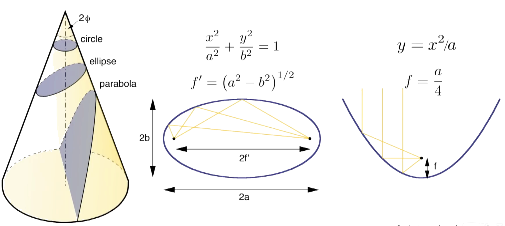
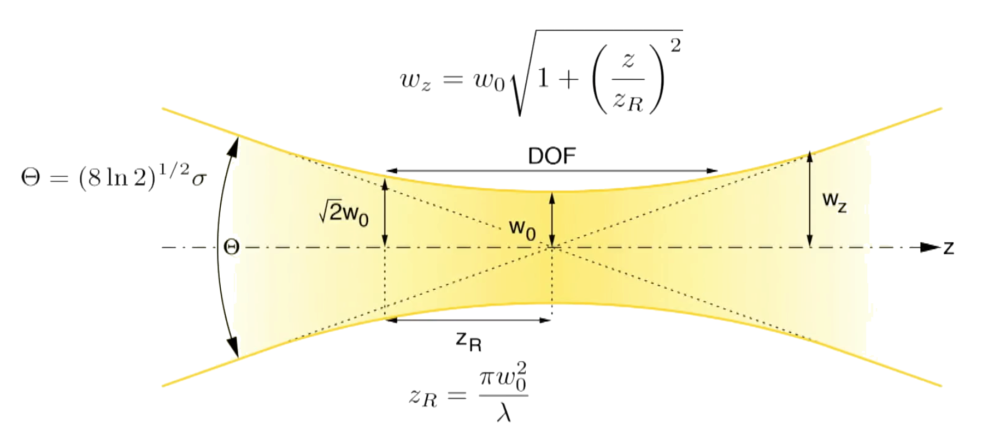
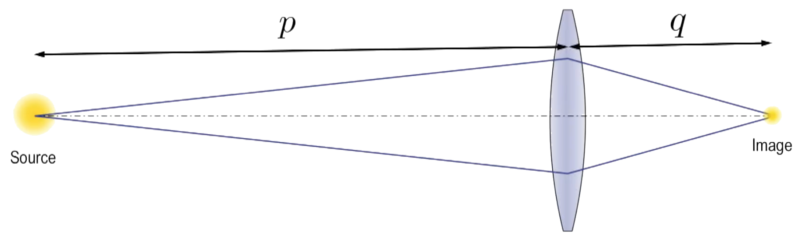
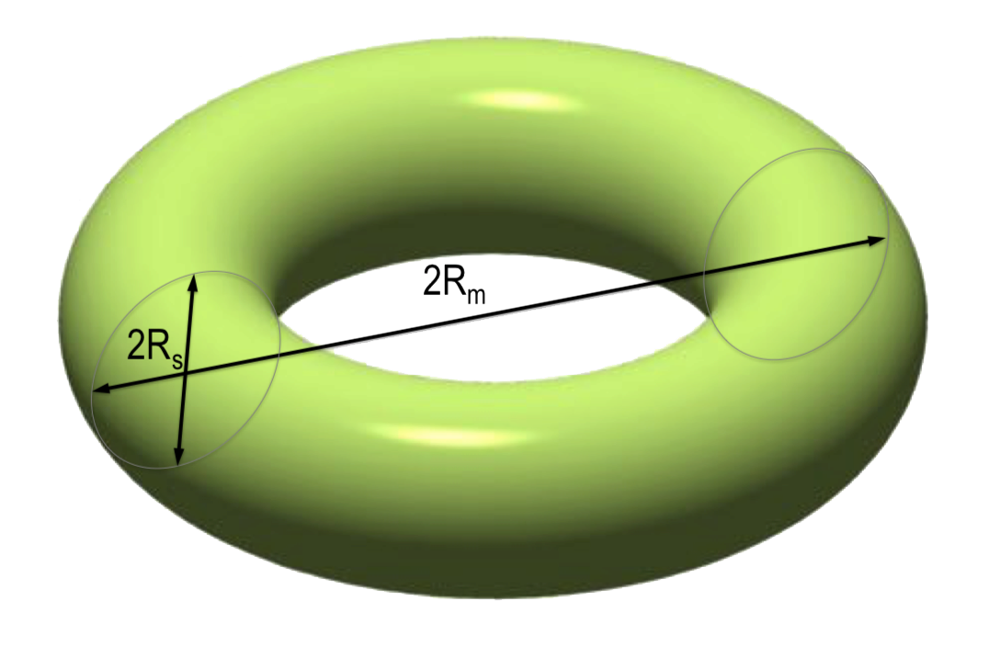
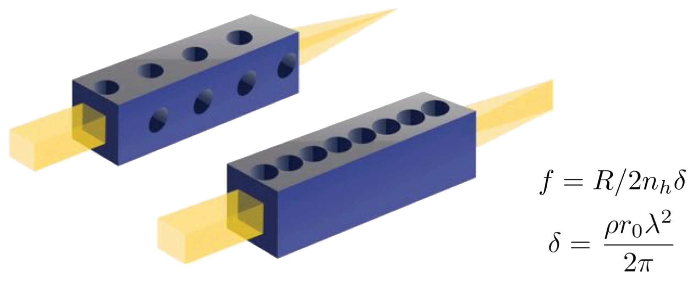
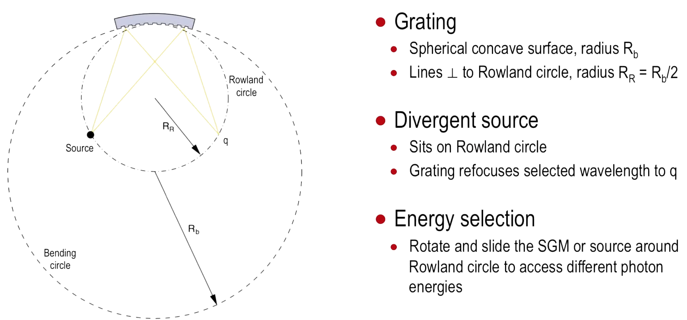
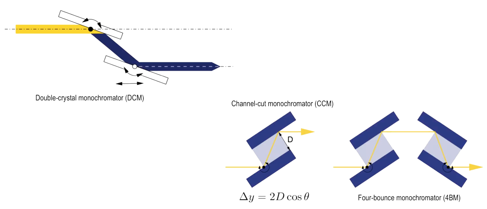
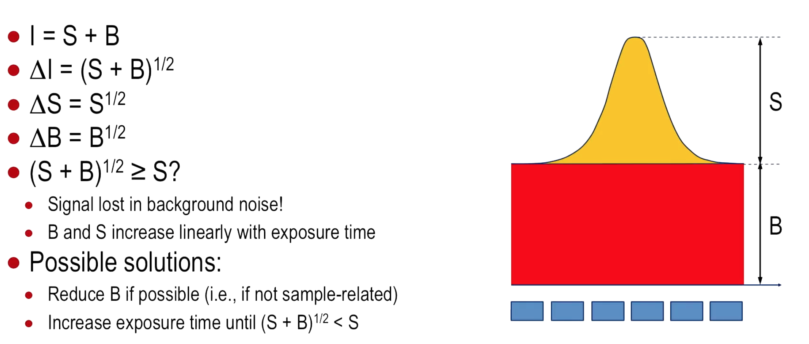

# Synchrotrons and X-Ray Free Electron Lasers
# Week 5: Beamlines and Instrumentation

## Beamline Overview

|  |
|:--:|
| *Generic Setup of a Beamline.* |

## Front-End

The front end contains the first components after the source and acts “**cleaning up**” the source radiation before it impinges on the primary optics and other components.

Its primary functions include **monitoring the position of the x-ray beam**.

The front end acts **blocking the Bremsstrahlung radiation** and **filtering out unwanted part** of source spectrum. Also defines the acceptance angle of the beamline.

### Beam-position Monitors

|  |
|:--:|
| *Examples of Setups of a Beam-position Monitors.* |

The simplest is simply a thin **wire** that can be traversed across the beam, which generates a photocurrent proportional to the beam intensity.

This provides one coordinate of the beam position; the orthogonal coordinate can be obtained by placing a second wire monitor at 90 degrees to the first.
Both coordinates can be simultaneously determined using **four blades**.

A more modern approach is to use thin transparent windows (often diamond) coated
with an array of ultrathin metallic pads.

This delivers **not only directly the beam position, but also the profile** of the beam. The acceptance angle of the source needs to be defined.

#### High-pass Filter

The high-pass absorption filter removes the unwanted x-rays (usually soft x-rays) from the beam.

They are build of **artificial diamonds**, once their specifications for this are strict - it should efficiently absorb soft x-rays (typically up to approximately 5 keV), and will thus heat up substantially, meaning the filter must have a high melting temperature and remain mechanically robust. This heat also needs to be efficiently dissipated, requiring good thermal conductivity.

### X-ray Mirrors

The primary optics typically include one or more mirrors which may or may not also focus, plus a dispersive instrument, the monochromator, used to select a certain, normally narrow, range of wavelengths.

|  |
|:--:|
| *Reflection in X-Ray Mirrors.* |

Even the most collimated synchrotron beam has a finite cross-section, with a height typically of the order of a millimeter at the primary optics, which may be  or further downstream of the source. This means, **as the photon energy increases, the critical angle gets smaller**, and the footprint of the beam becomes longer as one is forced to reduce the incident angle.

|  |
|:--:|
| *Harmonic suppression in X-Ray Mirrors.* |

One of the most effective ways to achieve harmonic suppression is explained here in the context of mirror reflectivity. Let us consider a particular photon energy, highlighted here with the red arrow. If we set the incident angle to be only marginally below the critical angle for the mirror at this photon energy, then the double of this energy will have its critical angle **below** the incident angle and will be only inefficiently reflected.

#### Slope Error

The reason that mirrors are not fabricated with lengths **much more than a meter** is because their **quality deteriorates**. The two main properties defining mirror quality are the so-called “slope error” (the amount of wobbliness of the surface over macroscopic distances) and the atomic roughness.

This does not mean the surface needs to be atomically flat without any imperfections along the entire length of the mirror, but it should maintain on average the desired specifications within at least one or two multiples of the coherence lengths of the radiation being reflected.

### Focussing Mirrors

Ellipses and parabolas are conic sections:

- An ellipse is a section for which the sectional plane subtends an angle greater than  with the cone axis, where  is the opening half angle of the cone;
- A parabola is described by the intersection between a cone and a plane for which the cone-axis - plane angle is exactly ;

|  |
|:--:|
| *Optics of Focussing Mirrors.* |

**Ellipses** are therefore excellent shapes for refocussing a small source via **reflection**. **Parabolas**, on the other hand, **focus parallel light** to a point.

|  |
|:--:|
| *Limits to Focal Spot Size.* |

The more focussed the beam , the smaller the focal spot, and the shorter the depth of field.

#### The Lensmaker Equation

|  |
|:--:|
| *Explaining the Lensmaker Equation.* |

The lensmaker equation states that the reciprocal of the focus of a lens, , equals the sum of the reciprocals of the source - lens distance  and lens - image distance .

The degree of magnification is  - hence values greater than unity will blow up the image size compared to the source, while demagnification with  less than one, will focus down the image to sizes smaller than the source.

#### Coddington's Equations

The Coddington equations relate ,  and , with the bending radii  and .

-  thus focusses in the transverse plane perpendicular to the bending plane, which in the case shown here is the vertical direction;

-  is the sagittal bending radius required to focus in the direction perpendicular to the meridional focussing, here horizontally;

In general, the incident angles on dispersive monochromator elements is larger, and the meridional and sagittal radii less radically different from each other. A convenient shape for achieving sagittal and meridional focussing in one element is **the toroidal mirror**.

|  |
|:--:|
| *Scheme of a toroidal mirror.* |

#### Kirkpatrick-Baez Mirrors

Kirkpatrick-Baez mirrors provide independent orthogonal focussing using two cylindrically bent surfaces. This has the advantage that vertical and horizontal focussing are decoupled.

|  |
|:--:|
| *Scheme of a Kirkpatrick-Baez mirror.* |

It is possible to dynamically bend the mirrors using a flexor system, thus allowing adjustment of the position of the focal spot.

### Compound-refractive Lenses

Compound refractive lenses, or CRLs, in their simplest form, consist of holes drilled out of transparent material such as beryllium.

|  |
|:--:|
| *Scheme of Compound-refractive Lenses.* |

CRLs have the **advantage** that they are **easy to align** in the x-ray beam, they do not divert the beam axis, and elements can be stacked after one another to change the focal length.

Their main **disadvantages** are that the focal length is proportional to the square of the x-ray photon energy, which means that they **must be repositioned if the photon energy is changed**; and that the transmission is in general fairly poor.

The choice of material depends on the photon energy range for which the CRL
is being manufactured, the required focal length, and the acceptable loss in flux due to absorption.

### Fresnel Zone Plates

Fresnel zone plates, or FZPs, are diffractive focussing lenses consisting of a set of concentric rings. These rings can either be opaque, in which case light passes through the gaps in between them, or, in the case of so-called phase-FZPs, have a specific height for the thicker rings, in order to enhance diffractive effects by adjustment of the optical path length.

|  |
|:--:|
| *Scheme of a Fresnel Zone Plate.* |

The general approach of FZPs is to design them so that light being scattered as it passes through different parts of the FZP will always have an integer number of wavelengths path difference at the focal spot.

The inverse dependence of the focal length on lambda implies a linear dependence with photon energy. This is less severe than the square dependence of CRLs with energy, which can make FZPs more attractive for use with unmonochromatized XFEL radiation, which can have a substantial bandwidth.

## Primary Optics

### Monochromators

**Monochromator** select a certain bandwidth, or set of bandwidths, of frequencies from synchrotron-radiation sources.

|  |
|:--:|
| *Types of Monochromators.* |

There's a strong correlation between photon energy and d-spacing. This should come as no surprise - a high photon energy is associated with short wavelengths, for which one needs a diffraction element of similar periodic dimensions.

#### How do grating and crystal monochromator differ from each other?

Gratings can come in various flavours regarding their groove profiles. They're typically fabricated via advanced lithographic and etching techniques on glass
substrates.

In the case of a crystal, for which  is a few Angstroms, interference of hard x-rays is between successive layers of atomic planes perpendicular to the scattering vector, which therefore follows the famous Bragg law.

#### Spherical Grating Monochromators

As was briefly mentioned in the first video of this week, it is possible to bend dispersive
elements in order to simultaneously disperse the radiation (monochromatize) and to focus
it. In spherical-grating monochromator (SGMs) the grating surface has a concave spherical
form with a radius R_b.

|  |
|:--:|
| *Scheme of Spherical Grating Monochromators.* |

#### Crystal monochromators

A common configuration is the double-crystal monochromator, using two identical crystals in the nondisperive mode. This not only provides greater flux, but also allows the beam to emerge from the mono parallel to the incident beam.

|  |
|:--:|
| *Scheme of Crystal Monochromators.* |

Channel-cut monos are fabricated using just one single crystal which has had a central channel milled out. This adds simplicity and speed to changing the photon energy, requiring a single rotation stage, a definite advantage when performing rapid energy scans in certain types of spectroscopic experiments where chemical changes are to be followed rapidly.

The disadvantage of CCM is that the exit beam’s height will change as the CCM is rotated, though this can be made to be minimal by making the channel width to be as small as possible, and scanning over a not too large range of photon energies.

#### Multilayer Monochromators

In the case of multilayers, scattering is produced by a contrast in electron density at the interfaces between heavy “reflection” layers and lighter “spacer” layers. The only required periodicity is in one direction. Their **reflectivity can be very high**.

Lastly, the layers should have atomically smooth interfaces in order to perform properly. This is in essence identical to the Bragg equation used for crystals.

## Beamline Instrumentation: Detectors

An ideal detector would be able to:
- Resolve the spatial distribution of the x-ray signal;
- Have a high quantum (or capture) efficiency;
- Deliver signal strengths directly proportional to the x-ray intensity;
- Be able to record both weak and strong signal simultaneously (high dynamic range);
- Record data rapidly;
- Be devoid of internal artefacts;

### Noise

Any stochastic or random process composed of a series of discrete events, such
as the arrival of x-ray photons on to a detector element, is subject to statistical, or Poisson noise. If the average number of events in a measurement is , then the scatter in the data is .

The careful experimenter must therefore decide how best to invest his or her precious beamtime: does improving the signal-to-noise ratio of a given signal by a factor of two, justify the necessary fourfold increase in acquisition times, or would this time be better invested in recording other data points?

Most detectors also have another source of noise called dark noise, which occurs even when there is no incident signal. For example, photosensitive diodes such as CCD pixel elements exhibit dark noise, caused by crystallographic defects in the depletion region of the diode
device. Modern detectors have **effectively zero dark noise** on account of the fact that they are not based on diode technologies.

Readout noise is a source of spurious signal in CCD detectors produced in the on-chip amplifier used to convert the collected charge produced by absorption of x-rays to a voltage (via a capacitor) in the readout process after the exposure. This becomes particularly critical when reading out very weak signals.

|  |
|:--:|
| *Comparison between signal and background.* |

Such a detector has no spatial resolution, other than that provided by slitting down the response area. This is a so-called point detector.

#### Photon counting and integrating detectors

Imagine a train of photons incident on a detector. There are two different photon energies, due elastic scattering of the incident beam, and lower-energy fluorescence signal at characteristic energies, as spikes of two different heights.

The philosophy behind photon-counting detectors is each detected photon
produces a short-lived voltage spike in a solid-state amplifier, the spike height being proportional to the photon energy. Internal electronics allow one to distinguish between these photon energies by setting a threshold voltage and comparing this to that produced by the absorbed photon.

CCDs and other integrating devices operate by accumulating charge each time a photon is detected. So the photons are not read off one by one, but instead, the total generated charge in each pixel at the end of the exposure is converted to a digital signal using an analog-to-digital converter (ADC). The amount of added charge for each incident photon is proportional to the photon energy.