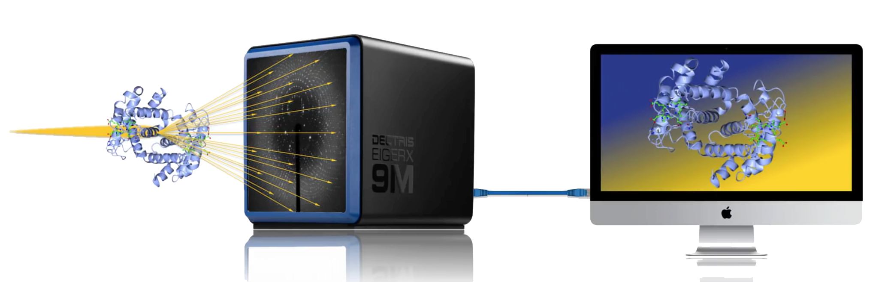
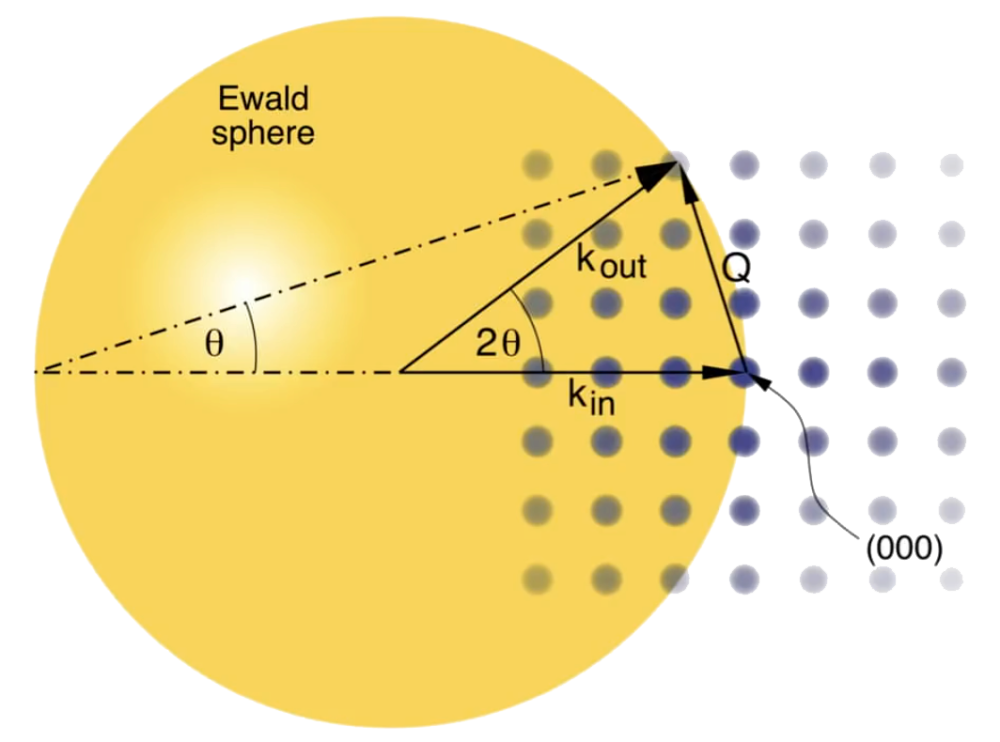
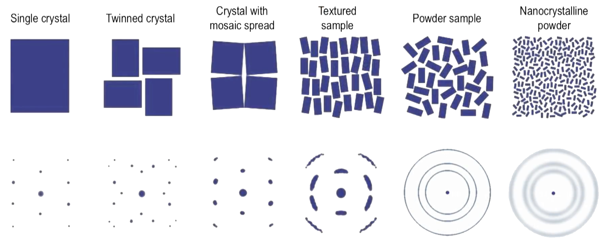
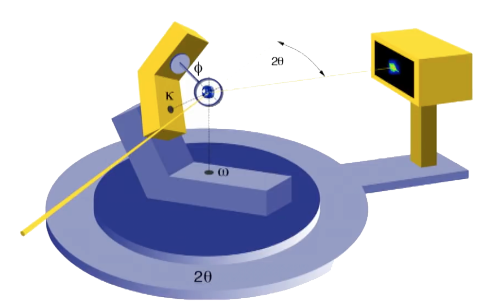
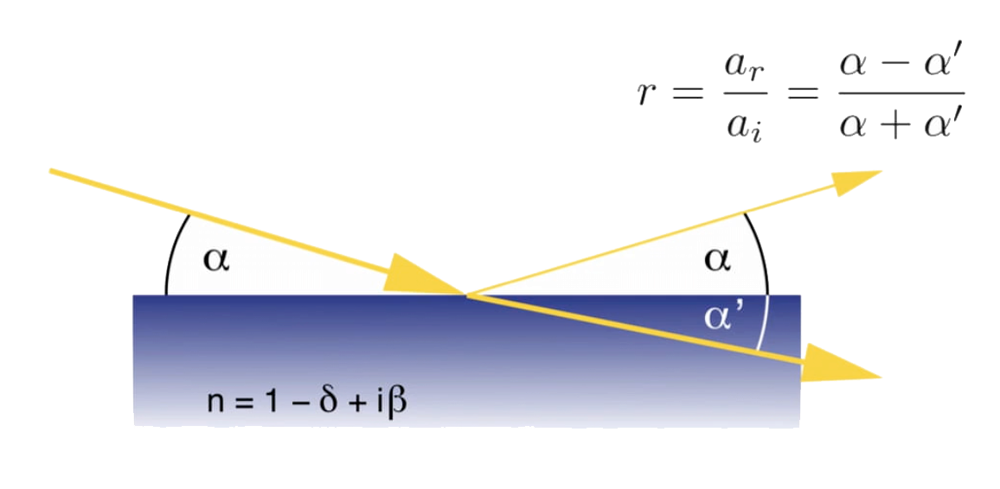
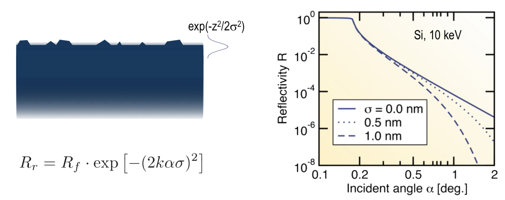
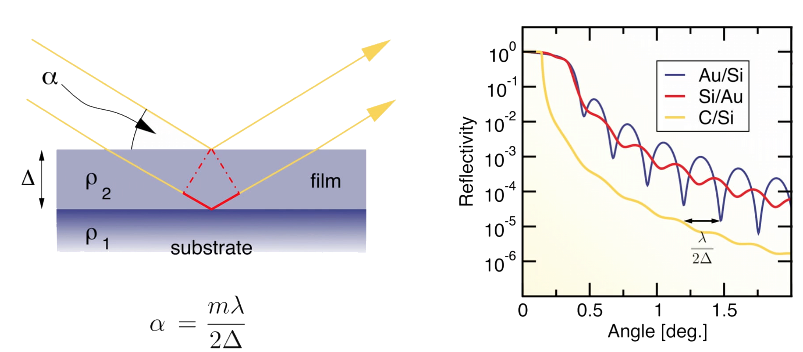
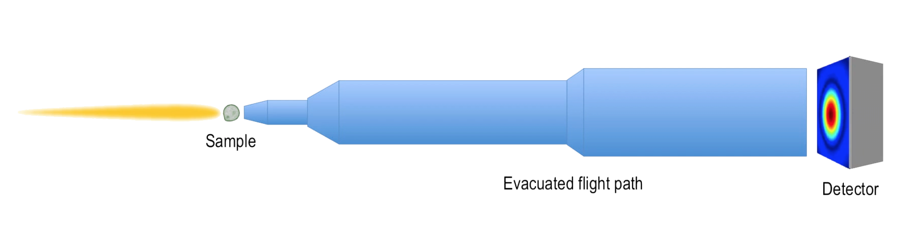

# Synchrotrons and X-Ray Free Electron Lasers
# Week 6: Diffraction and Scattering

## What is XRD and why is it used?

Using XRD it's possible to access the atomic structure of chemical systems. For example, the discover of DNA double-helix structure (Nobel Prize to Watson and Crick).

It's **not possible** to build X-Ray lens and it's used the x-ray scattering in a area detector to obtain image data. We send this scattered signal to a computer which then performs the operation of the lens using mathematical algorithms with Fourier transformations. This is called **phasing** the signal, as the detector measures not the signal amplitude but the intensity.

|  |
|:--:|
| *Representation of X-Ray Scattering using Area Detector to obtain images.* |

## Diffraction and Scattering at Synchrotrons

Main reason to profit is the **High Brilliance**, which can be separated as:

- Low Divergence
  - High angular resolution scattering
  - Diffraction patterns
- Tight Focus
  - Small sample sizes (protein crystals have )
- Low Emittance
  - Large working distance
  - Bulky sample environments
- High Flux
  - Fast data acquisition turns possible time-resolved studies

|  |
|:--:|
| *Effects of photon energy in the scattering.* |

Access high photon energies turns possible to penetrate deep in the samples and get bulk properties.

A **unique property** of synchrotron light is its **tunability**.

As the scattering amplitude and phase of a certain atom type changes abruptly close to an absorption edge of that atom, that is, at an energy equating the binding energy of one of the core electrons. By recording diffraction data in this region, techniques such as multi-wavelength anomalous diffraction (MAD) and single-wavelength anomalous diffraction (SAD), can unambiguously solve
the phase problem.

- **MAD**: exploits the tunability are only possible at synchrotrons and XFELs;
- **SAD**: uses a single wavelength, can in principle be carried out using a lab source;

### Diffraction patterns and Reciprocal Space

The larger the separation between the scatterers, the smaller their angular separation, or separation in reciprocal space, and vice versa.

|  |
|:--:|
| *Examples of diffraction patterns.* |

The scattering vector  was defined previously as the difference between the incoming and scattered wavelengths:

In terms of Miller indexes  (crystal surface structure):

|  |
|:--:|
| *Ewald Sphere.* |

The **Ewald sphere** is applied to **reconstruct** the crystalline structure.

In the figure, the incident beam points in the (000) direction, whereas the scattered beam, if at a Bragg peak defined by the Miller indices (), terminates on that Bragg maximum. The orientation of the crystal that will result in the  Bragg peak lighting up is when this point in the diffraction pattern sits on the Ewald sphere.

**Rotating a crystal around an axis** while recording the pattern using an area detector, different Bragg maxima will light up and can be recorded, as shown schematically here. This is the basic approach to most single-crystal diffraction experiments.

## Crystalographic Techniques

### Crystalline Sample Types

|  |
|:--:|
| *Examples of Crystalline Sample Types in order of disorder degree.* |

The nanocrystalline powder structure representes the more **"real"** kind of sample.

### Different Approaches to Single Crystals

#### Laue Method

Although the majority of x-ray diffraction methods use (quasi-)monochromatic x- rays
and a sample which must be rotated in space in order to satisfy the diffraction condition,
it is also possible to record diffraction patterns of stationary single crystals using
a broad spectrum of x-rays.

Consider a diffraction pattern (a regularly spaced set of diffraction maxima),
or Bragg spots, in reciprocal space. If we irradiate the crystal with a quasi-monochromatic x-ray beam, it is unlikely that the crystal will be oriented such that a diffraction spot lies on the surface of the Ewald sphere.

|  |
|:--:|
| *Comparison between using a single wavelength and a sort of them.* |

A large subset of all the possible detected diffraction peaks with different wavelengths can be accessed by rotating the crystal and recording the signal frame after frame.

#### Selected Bragg-Peak Method

It's useful to record a subset of the diffraction data. So, it can be used to follow specific Bragg points and observe physical phenomena related to structural changes.

An example might be orbital, charge (i.e., valence), or even spin ordering of electronic states in electronic materials, which increases the crystal periodicity and thereby introduces additional Bragg peaks at nominally non-integral positions in reciprocal space.

In the experiment, the crystal is oriented to light up a certain diffraction peak.

|  |
|:--:|
| *Illustration of the Bragg-Peak Method.* |

With the advent of modern detectors, with readout times in the range of a few milliseconds,
a new approach called fine **phi-slicing** became possible. The exposures were over much narrower angular ranges by an order of magnitude, and the crystal was allowed to rotate continuously, as the dead time between exposures was sufficiently small. A full data set can be recorded in just a few seconds.

Because the angles covered by each exposure are typically smaller than the angular width
of the diffraction signal, the peak shape and position can be accurately determined using fine phi-slicing.

#### Debye-Sherrer Method

For some materials, it may prove to be very difficult or indeed impossible to grow macroscopic crystals of sufficient quality to be investigated using single-crystal diffraction. In such instances, powder diffraction (also called the ‘Debye-Scherrer’ method) is applied.

Powder diffraction not only provides a rapid and nondestructive means to identify the composite parts in multicomponent mixtures or complex system, but is also indispensable in extreme environmental studies, where phase changes are studied as a function of temperature and/or pressure.

Because of the cylindrical symmetry of this method, all the necessary information can
be recorded in a narrow strip of the rings, that is, along one coordinate, .

|  |
|:--:|
| *Illustration of the Debye-Sherrer Method.* |

### Macromolecular Crystallography

Macromolecular Crystallography is a form of single-crystal diffraction which uses the rotation method.

|  |
|:--:|
| *Some features of Macromolecular Crystallography.* |

The large unit-cell dimensions also mean that the diffraction spots in MX are separated by much smaller angles and that many more diffraction peaks will lie on the Ewald sphere and thus be detected.

## X-Ray Reflectivity

X-ray reflectivity one measures the specular reflectivity of x-rays as a function of incident angle.

Provides informations about electron-density profiles, surface or interface roughness, film thickness and density, etc.

|  |
|:--:|
| *Representation of X-Ray Reflectivity.* |

The reflectivity amplitude  is given by the Fresnel equations for reflectivity and transmission, and is obtained the incident () and transmitted () angles across the surface:

The reflectivity intensity  is given by:

For angles significantly greater than :

### Surface Roughness

The reflectivity drops off even more rapidly if the x-rays are being reflected off a rough
surface, even for roughnesses of the order of a few Angstroms.

|  |
|:--:|
| *Effects of Surface Roughness in the Reflectivity.* |

The roughness can be described by a gaussian distribution, so the reflectivity intensity  is given by:

### Thin Films

|  |
|:--:|
| *Effects of Film Thickness.* |

It is essentially a restatement of Bragg’s law, where we approximate the  with  for the shallow angles, and the “d-spacing” is simply the film thickness Delta.

This causes the reflectivity curve to exhibit oscillations known as “Kiessig fringes”. The separation between fringes is simply .

### Atomic-Resolution Film-Growth Monitoring

The decrease in reflectivity with surface roughness can be exploited in in-situ XRR
experiments to monitor film growth.

|  |
|:--:|
| *Representation of Atomic-Resolution Film-Growth process.* |

If the film grows in a layer-for-layer manner (called Frank van der Merwe growth), then the roughness will vary sinusoidally, being maximally rough when each new monolayer is half complete.

## Small-Angle X-Ray Scattering (SAXS)

X-ray scattering from larger objects up to about a micron in size can also provide important structural and dimensional information.

The samples investigated using SAXS need not be crystalline. Scattering occurs, just as it does in x-ray reflectivity, through electron-density variations , and not from individual atoms, the case in diffraction.

Typical information extracted from SAXS include characteristic shapes and sizes, surface-area to volume ratios, and in special cases, the relationship between two well-defined sizes, such as between the radius and thickness of a circular platelet.

|  |
|:--:|
| *Representation of SAXS experimental setup.* |

The scattering vector  is given by:

## Crystallography in XFELs

It was predicted that crystallites could survive irradiation by XFELs just long enough before exploding. This concept of diffraction before destruction led to the method of serial femtosecond crystallography, in which successive diffraction images of freshly delivered and randomly oriented crystals are recorded.

The delivery method may be through some sort of liquid jet, an aerosol, or on a fixed membrane system. To obtain a complete diffraction pattern with a resolution that allows identification of individual atoms, several hundred thousand or even more partial patterns must be recorded.

|  |
|:--:|
| *Some ideas in Crystallography in XFELs.* |

Single-particle imaging using XFEL radiation was one of the first long-term goals when
funding for XFELs was being sought. It is the coherent cousin to SAXS - the whole mesoscopically-sized particle is irradiated coherently and the scatter pattern is recorded. The major difference here being that each particle is obliterated after each shot.

