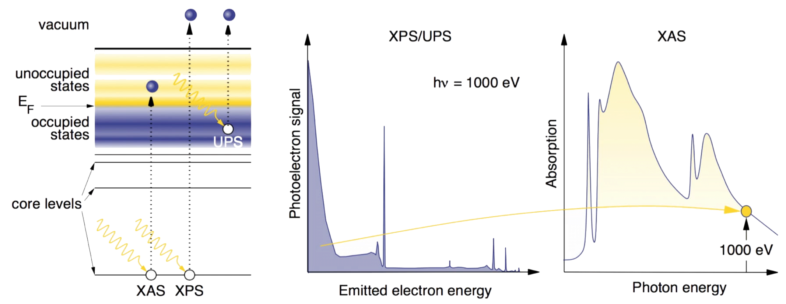
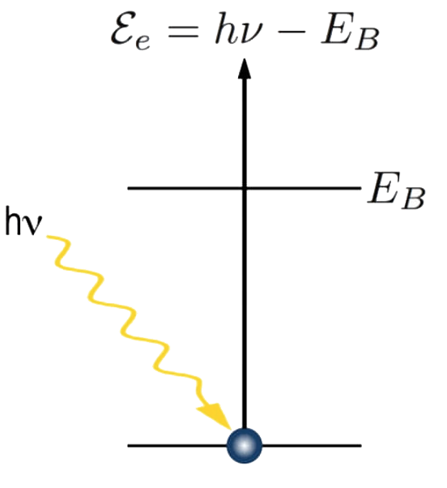
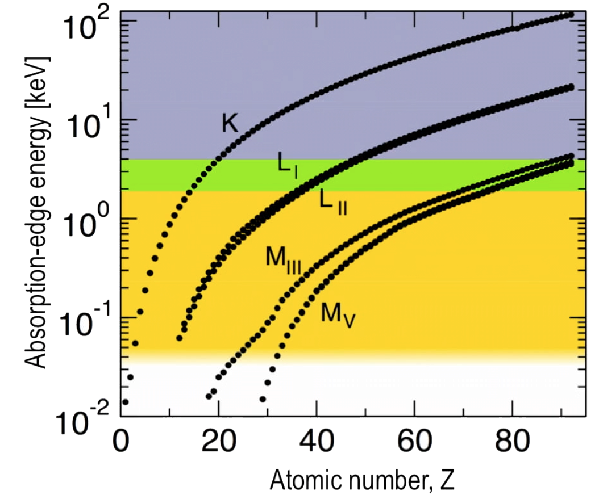
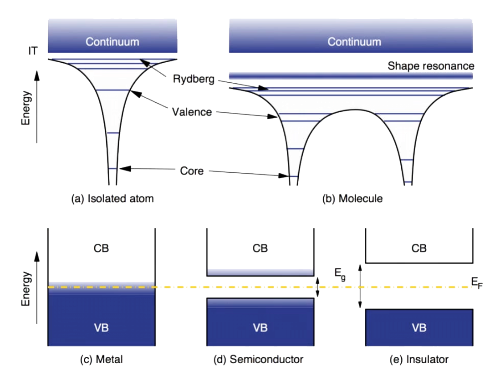
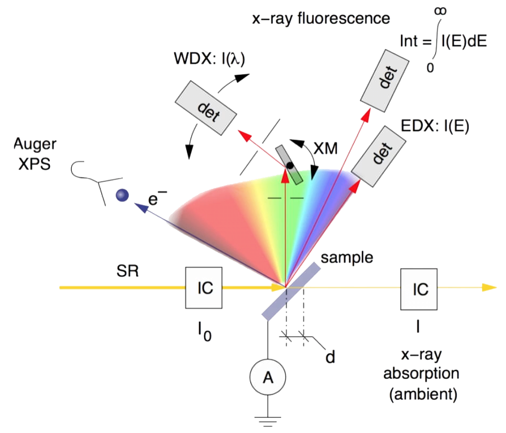
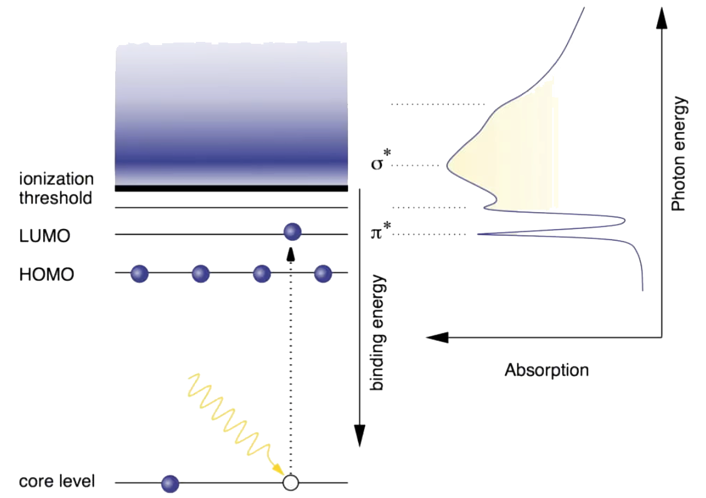
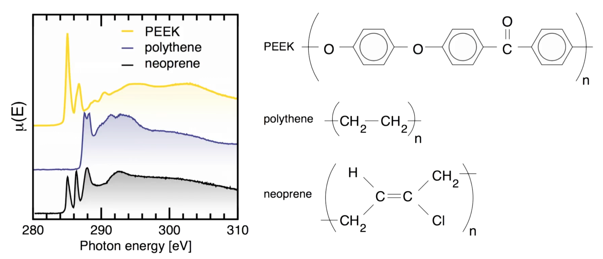
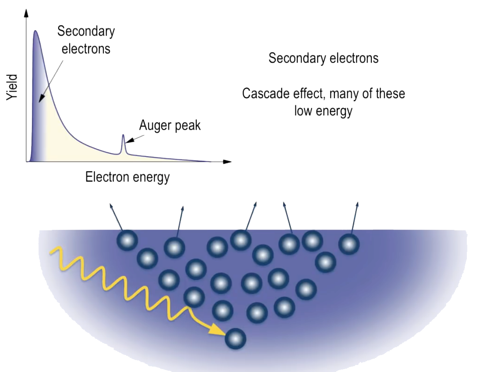
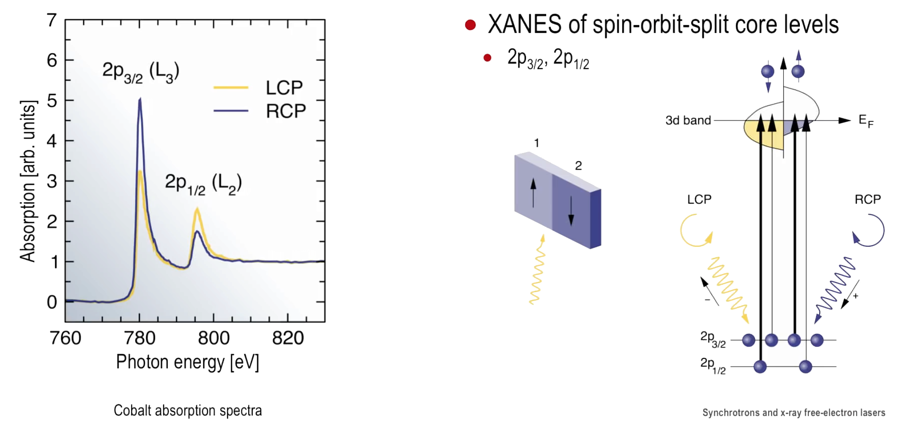
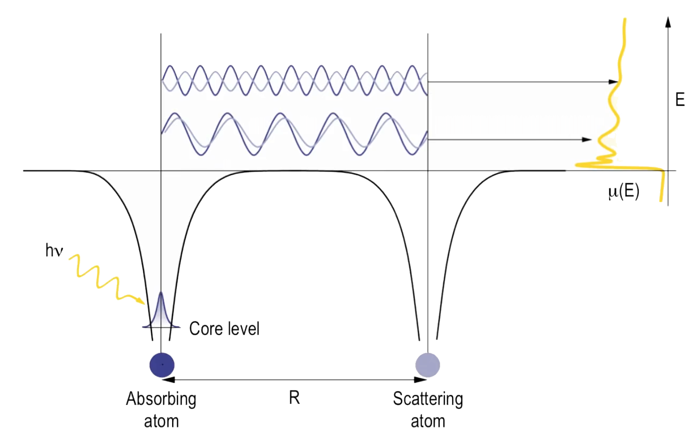

# Synchrotrons and X-Ray Free Electron Lasers
# Week 7: UV and X-Rays Spectroscopy

## Spectroscopies at Tunable Light Sources

Synchrotrons are unique insofar that one can tune the photon energy, allowing experiments to be performed that are excluded to lab-based x-ray sources.

Three main categories:

- Absorption:
  - Near Absorption Edge: XANES
  - Further above the Absorption Edge: EXAFS
- Fluorescence
  - Fixed energy incident photon
  - Resonant Inelastic Scattering: RIXS
    - "Photon-in - Photon-out" technique where the fluorescence
spectra as a function of the incident photon energy are recorded;
- Photoemission
  - X-Ray Photoelectrons: XPS
  - Using ultraviolet radiation and soft x-rays: ARPES
  - Using hard x-rays: HAXPES

### XAS, XRF and PES

XANES and EXAFS provide information on local chemistry, surface adsorbate configurations, and local structure out to a few atom-distances.

X-ray Fluorescence (XRF) provides information on chemistry, and, more commonly and depending on the detection technique, elemental content.

|  |
|:--:|
| *Absorption regions according to the edge.* |

XAS promotes core-level electrons to **unoccupied valence-state levels** and thereby probes these upper states by varying the incident photon energy.

XANES relates to the region just around and marginally above absorption edges. The excited electrons therefore have low energies and large de-Broglie wavelengths, making them poor probes to investigates details of the local environment around the absorbing atom.

XPS and UPS, the electrons are directly **promoted into the vacuum** and their signal intensity as a function of emitted electron energy (or binding energy) is recorded for any given incident photon energy.

|  |
|:--:|
| *Comparison between XPS and XAS techniques.* |

### Energy Balance and Transition Probabilities

Transition probabilities between states  and , or intensities, are proportional to the dipole transition integral, according to quantum mechanics selection rules:

The dipole operator is antisymmetric, then the product of  and  should be antisymmetric too (or the intensity will be zero).

|  |
|:--:|
| *Representation of the energy of a photoelectron .* |

The wavelength  of an photoelectron, which depends of the binding energy  of the material, the is given by:

|  |
|:--:|
| *Relationship between Absorption-edge energy and the Atomic Number.* |

The soft- tender- and hard-x-ray regimes are shown in yellow, green, and blue, respectively. The most strongly bound K-electron of uranium can be accessed at some synchrotron facilities.

### Inelastic Mean Free Path (IMFP) and the Universal Curve

An important parameter is the inelastic mean free path which is the distance through which an electron must pass in a material before it is scattered inelastically with a probability of .

When an electron has high energies, its small de-Broglie wavelength means that it has a smaller effective cross-section and larger IMFP.

The dominant mechanism to induce **inelastic scatter of electrons** is through excitation of so-called “**plasmons**”, or collective oscillations of electrons in the material.

- At energies much lower than , the electron has insufficient energy to excite these plasmon modes, and the inelastic mean free path increases rapidly;
- Between approximately 10 and a few hundred to a thousand eV, the IMFP takes on values of a few Angstroms to ten or so Angstroms. This is of the order of the top few atomic layers of the sample, and hence techniques that record such photoelectrons are in general highly surface sensitive;

|  |
|:--:|
| *The so-called Universal Curve.* |

The variation of the IMFP at a given electron energy between different elements is fairly modest. The reason for this is that it is dependent on average electron-electron distances, which are proportional to the cube root of the electron density, which for most materials varies no more than a factor of approximately 30. The cube root of 30 is a little over 3, hence the spread of data points lie all fairly comfortably within this range.

### Electronic Density in Condensed Matter

The well-defined valence orbitals of an atom become less well defined in molecules due to interaction of orbitals and the formation of bonds. In condensed matter, there are so many atoms and the orbitals generates band structures.

|  |
|:--:|
| *Differences between electronic band structures in different materials.* |

In a **metal**, the top of the valence band and bottom of the conduction band **meet**, allowing the promotion of electrons to the otherwise empty conduction band even with the tiniest of excitation energies.

In **semiconductors**, there exists a band gap that can be overcome by a certain fraction of the valence-band electrons, spending on the **size of the gap** and the **temperature** of the system.

In **insulators**, the band gap is so large that effectively **no electrons** can access the conduction band.

**Core orbitals remain well-defined even in condensed matter.**

### X-Ray Spectroscopy experimental setup

|  |
|:--:|
| *X-Ray Spectroscopy experimental setup.* |

- Monochromatic synchrotron radiation is allowed to impinge on a sample;
- X-ray absorption spectra can be performed by measuring the amount of light that passes through a thin sample;
- The x-ray intensities before entering the sample () and after () are measured using ionization chambers (IC) or other beam-intensity monitors (suited for samples that cannot be placed in vacuum);
- The total electron current through an ammeter between the sample and ground can also be used to indirectly determine the absorption spectrum. In this case, the sample and detectors must be in vacuum;
- X-ray fluorescence spectra can be recorded, either using a crystal monochromator (XM) in wavelength-dispersive spectra (WDX), or by using a dispersive solid-state semiconductor device (EDX);
  - The integrated fluorescence yield can also be used as a measure of absorption strength.
- Unwanted detection of elastically scattered x-rays is best achieved by placing the detector on the polarization axis of the synchrotron radiation;
- The kinetic energy of photoelectrons and Auger electrons can be determined using electron energy-dispersive analyzers;

## X-ray absorption near-edge spectroscopy: XANES

Also called Near-edge x-ray absorption fine structure (NEXAFS).

XANES is a technique in which the photon energy is so chosen that a core-level electron can be promoted to an unoccupied but bound or quasibound orbital of the system.

Depending on the system, these unoccupied states can be diffuse, but can also be fairly sharp, especially for example, for molecule that are weakly adsorbed on a surface and may only weakly interact with that “host” material.

The oscillations in the absorption cross-section in the neighbourhood of the absorption edge caused by excited bound states and also the quasicontinuum just above the ionization threshold, is the XANES signal.

|  |
|:--:|
| *Representation of XANES process.* |

The lowest-energy XANES signals occur below the absorption edge, and are referred to pre-edge transitions. Pre-edge features are strongly influenced by the symmetry of the local environment around the absorbing atom.

|  |
|:--:|
| *Examples of the application of XANES to 5d metals.* |

The ground-state electronic configuration of Re is that of [Xe], plus . As one moves to the right in the periodic table, the remaining five available 5d-states are filled. In gold, these states are fully occupied.

- In the elements Re to Pt, the bound but unoccupied 5d-states, which are below the ionization threshold, are seen as intense peaks, though this become weaker as the d-orbitals are successively filled;
- As gold has no such unoccupied states, excitation is necessarily directly into the unbound continuum, and its XANES spectrum is consequently much flatter;

|  |
|:--:|
| *Example of the application of XANES to study the spatial orientation of molecules.* |

XANES can also be applied to investigate spatial orientation of molecules in a surface. It's possible to evaluate the orientation by the excitations related to  and  bonds.

### Scanning transmission x-ray microscopy: STXM

STXM can be thought of raster-scanning XANES operated in the transmission mode. It is a technique for spatially mapping with submicron resolution the chemical contents of organic samples.

|  |
|:--:|
| *STXM experimental setup.* |

STXM is frequently used to characterize polymer films, because of the very rich and informative C 1s XANES spectra of polymers.

|  |
|:--:|
| *STXM experimental setup.* |

###  Photoemission electron microscopy (PEEM)

PEEM is a technique that images the spatial distribution of electrons emitted from a sample due to x-ray absorption in the XANES region.

It uses photoelectrons for its signal and is not an electron-spectroscopy technique. In PEEMm the energies of the electrons are not distinguished.
Instead, the absorption coefficient is indirectly measured via the yield of secondary electrons (released by the system after multiple scattering events in a cascade process originating with the directly produced photoelectron from the absorbing atom).

|  |
|:--:|
| *Representation of secondary electrons in PEEM.* |

PEEM is a form of ‘spectromicroscopy’ – full-field images are recorded at different photon energies, in contrast to STXM, a microspectroscopy technique in which the focussed x-ray beam is rastered across the sample.

The secondary electrons are imaged using a 2-D detector. PEEM does not use a scanned probe electron beam, but instead the sample surface is uniformly illuminated by the x-rays.

### X-ray magnetic circular dichroism: XMCD

XMCD is a variant of PEEM commonly used to investigate domain formation in ferromagnets by detecting differences in their absorption spectra according to the type and orientation of the polarization of the incident x-rays.

- Linear version to study antiferromagnetic systems;
- The effect is usually small and detecting XMLD is more challenging than XMCD;

It works because magnetic materials have an imbalance of electrons with spin up
and spin down in the valence band.

|  |
|:--:|
| *Representation of XMCD processes.* |

To obtain the XMC signal, one uses circularly polarized light.

In the case of domain 1, an incident RCP photon has its orbital angular momentum pointing forwards levels. The opposite case arises for LCP photons, whereby the  states are favoured. If we focus on region 2, the spin-down 3d-sub-band is shifted to higher energies than the spin-up sub-band.

## Extended x-ray absorption fine structure: EXAFS

EXAFS begins approximately 50 eV above the absorption edge and consists of oscillations in the absorption up to as far as a keV above the edge.

EXAFS probes electrons with wavelengths of the order of  to , similar to if slightly smaller than interatomic distances. The mean-free path of electrons in this range is short, of the order of a few Angstroms, hence EXAFS only probes the immediate neighbourhood of the absorbing atom.

EXAFS is an important technique in noncrystalline solids and liquids, as it yields information of the short-range structure.

|  |
|:--:|
| *Representation of EXAFS processes.* |

EXAFS is caused by single backscattering events by nearest-neighbour atoms of the outgoing photoelectron produced through x-ray absorption. The scattered waves interfere with the original photoelectron wave, which results in a change
in the electron density at the absorbing atom and consequently leads to a modulation of the absorption strength  as the photon energy is scanned.

The most important parameters in addition to the atomic absorption coefficient  are the **electron wavelength** , the number and type of nearest neighbours, and the distance  between the absorbing atom and neighbouring atoms.

- The EXAFS oscillatory signal increases with the number of neighbours in a given shell;
- The oscillation period dilates with decreasing shell radius;

The EXAFS Function is given by:

#### Time-Resolved Versions: QEXAFS and EDXAS

In quick-EXAFS (QEXAFS), monochromatic tuning of bending-magnet or wiggler radiation is achieved using a channel-cut monochromator.

In energy-dispersive x-ray absorption spectroscopy (EDXAS), a divergent white x-ray beam impinges on a bent crystal or grating sitting on an ellipse defined by its foci being at the source and the sample. This selects different wavelengths from the white beam, depending on the angle the divergent beam hits the bent crystal.

## Fluorescence Spectroscopy

Fluorescence spectroscopies are **photon-in - photon-out** techniques. These techniques can often be applied under ambient or indeed in-vivo environments, depending on the energy range of interest.

X-ray fluorescence generally probes the fluorescence spectrum resulting from absorption at a fixed incident photon energy, although excitation can also be via impact of energetic electrons. Resonant inelastic x-ray scattering, on the other hand, probes the emission spectra as a function of incident photon energy.

The energy ranges of XRF and XAS are related: where XRF ends, XAS begins. This is because the emission spectrum probes the highest-energy occupied states, whereas XAS spectra only begin at the lowest-energy unoccupied states.

### X-Ray Fluorescence

X-ray fluorescence is a powerful method for determining the chemical composition of objects that are either too thick for transmission-absorption measurements, or are insulating and therefore preclude photoemission techniques.

If the spectra are recorded with an energy resolution of the order of an eV or better, valuable information of the local oxidation state and chemical bonding can be gleaned.

### Resonant Inelastic X-Ray Scattering: RIXS

Both XRF and XAS are sensitive to local electronic structure and bonding around the absorbing/emitting atom. When one combines these techniques,
further detailed information becomes possible, in the relatively new technique of RIXS.

RIXS has many analogies with Raman spectroscopy. The energy difference between the emitted photon and the incident photon can range between some meV and a few eV. This energy loss, plus the momentum transfer and change in polarization between the incoming and outgoing photon is associated with the production of an electron-hole pair, induced by one or more important processes related to electronic properties, such as phonon, magnon, or low-energy electronic excitations.

|  |
|:--:|
| *Representation of RIXS processes.* |

In RIXS, neither the initial or final states
contain a core vacancy and thus momentum remains a good quantum number. This makes RIXS an important probe for the electronic band structure of a wide variety of materials.

In addition, because RIXS excitations are second-order and involve the virtual absorption of a photon, certain excitations (such as the d − d excitation between 3d-states in transition-metal oxides) are allowed, but which are forbidden in direct optical processes.

A unique feature of RIXS is the very large range of energies and momenta that can be transferred to the system under investigation in the inelastic scattering event. This is because photons instead of electrons (used in photoelectron studies) are used as probes.

## Photoelectron Spectroscopies

Techniques based on the Photoelectric Effect, where an electron (called photoelectron) is ejected from the system after the absorption of a photon.

|  |
|:--:|
| *Representation of different PES processes.* |

### Angle-Resolved PES: ARPES

ARPES attempts to determine the electron kinetic energies as a function of angle. With this information, the electrons’ momenta , , and  can be accessed, which should lead to a complete picture of the electronic structure.

Synchrotron radiation provides two further variables excluded to lab-based ARPES experiments, namely the possibility of tuning the incident photon energy and the possibility of varying the polarization.

### Photoelectron Diffraction: UPD and XPD

Ultraviolet photoelectron diffraction (UPD) and x-ray photoelectron diffraction (XPD) are techniques used to obtain direct structural information in the neighbourhood of the photoelectron emitter in single crystals.

The techniques depend on the strong forward-scattering nature of photoelectrons by neighbouring atoms, particularly for the higher kinetic energies found in XPD, which thus delivers sharper data than UPD.

|  |
|:--:|
| *Representation of Photoelectron Diffraction processes.* |

### Hard X-Ray Photoelectron Spectroscopy: HAXPES

Applied to study bulk properties. Because the bulk is being probed, the need for ultrahigh vacuum conditions, required in normal XPS, is obviated.

This increase in the probing depth increases the periodicity “seen” by the electron in the direction perpendicular to the surface, which thus reduces the uncertainty of the wavevector of the electrons in this direction.

Because the photon wavelengths at these high energies are generally significantly smaller than typical interatomic spacings, the photoemission matrix elements reduce to atomic cross-sections, thus simplifying data analysis.

