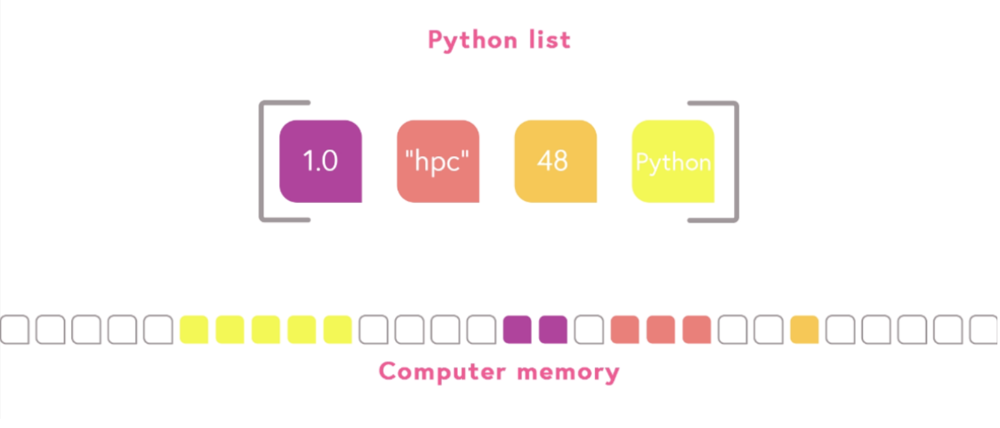

# Python in High-Performance Computing - PRACE

# 02 Week - Numerical Computing

Python's built-in data structures are not very suitable for numerical computing, especially when dealing with a large number of similar data and multidimensional arrays.

We will present NumPy, which is a third-party library for doing numerical computing in Python. It provides:

- a static multidimensional array which is very suitable for numerical data;
- tools and utilities to efficiently operate on large amounts of data;

## Differences between Python list and NumPy array

Python lists are very flexible, but they have a complex data structure to put in computer memory. This structure decreases the performance.

|  |
| :--------------------------------: |
|  Memory structure of Python List.  |

Both type and number of array elements is fixed at the time of creating the array NumPy, which knows how much memory is needed for the array and allocates large enough contiguous block.

- **Contiguous memory layout** allows also easier passing of NumPy arrays into high-performance libraries;

|  |
| :-------------------------------: |
| Memory structure of NumPy Array.  |

## Creating and accessing NumPy arrays

### Creating arrays from existing data

The simplest way to create a NumPy array is to use the array constructor and provide the data directly as an argument.

```python
import numpy
x = numpy.array((1, 2, 3, 4))
```

Unless explicitly specified, the datatype is automatically set based on the values used to create the array.

```python
data = [[1, 2, 3], [4, 5, 6]]
y = numpy.array(data, complex)

print(y)
print(y.shape)
print(y.size)
```

### Using helper functions

Two extremely helpful functions for generating ranges of numbers are called *arange* and *linspace*.

Similar to the regular *range()* function, *numpy.arange()* creates an array containing evenly spaces values within a given interval.

```python
a = numpy.arange(10)
```

Another common need is to generate a fixed number of evenly spaced values within an interval, which is exactly what *numpy.linspace()* does.

```python
b = numpy.linspace(-4.5, 4.5, 5)
```

One can also create an array of a given shape and initialize it to zeros, ones , or arbitrary value using the handy functions *zeros*, *ones*, or *full*.

One can also create a truly empty array by using the function empty. This will create an array and allocate memory for it, but not assign any values to it.

In addition to numbers, NumPy supports also storing non-numerical data, e.g. strings.

```python
s = numpy.array(['foo', 'foo-bar'])

dna = 'AAAGTCTGAC'
c = numpy.array(dna, dtype='c')
```

## Accessing arrays

NumPy arrays can be accessed in a similar way to Python lists.

- Only difference stems from the fact that NumPy arrays can be truly multi-dimensional;

To access a single element in a 2D array, one should use the index value in each dimension separated by a comma:

```python
data = numpy.array([[1, 2, 3], [4, 5, 6]])
x = data[0,2]
y = data[1,-2]
```

## Views and copies of arrays

To make a true copy of an array, one should use the *copy()* method:

```python
a = np.arange(10)
b = a
b = a.copy()
```

# Operating with NumPy Arrays

## Element-wise operations

```python
a = numpy.array([1.0, 2.0, 3.0])
b = 2.0

print(a * b)
# output: [ 2.  4.  6.]

print(a + b)
# output: [ 3.  4.  5.]

print(a * a)
# output: [ 1.  4.  9.]
```

## Elementary functions

NumPy provides also a wide range of elementary mathematical functions (sin, cos, exp, sqrt, log, …).

```python
import numpy, math
a = numpy.linspace(-math.pi, math.pi, 8)

print(a)
# output:
#   [-3.14159265 -2.24399475 -1.34639685 -0.44879895  0.44879895 1.34639685
#     2.24399475  3.14159265]

print(numpy.sin(a))
# output:
#   [ -1.22464680e-16  -7.81831482e-01  -9.74927912e-01  -4.33883739e-01
#      4.33883739e-01   9.74927912e-01   7.81831482e-01   1.22464680e-16]
```

## Vectorised operations

**For loops in Python are slow.**

If one needs to apply a mathematical operation on multiple (consecutive) elements of an array, it is always better to use a vectorised operation if possible.

### Examples

```python
# brute force using a for loop
arr = numpy.arange(1000)
dif = numpy.zeros(999, int)
for i in range(1, len(arr)):
    dif[i-1] = arr[i] - arr[i-1]
```

```python
# vectorised operation
arr = numpy.arange(1000)
dif = arr[1:] - arr[:-1]
```

## Array manipulation and broadcasting

When working with NumPy arrays it is sometimes necessary to manipulate the shape and/or size of them.

### Reshape

Even though the number of elements in a NumPy array is fixed, the shape of the array is not. One is free to change the shape as long as the number of elements stays the same.

```python
a = numpy.array([[1, 2, 3], [4, 5, 6]])

print(a.shape)
# output: (2,3)

a.shape = (3,2)

print(a)
# output: [[1 2],
#          [3 4],
#          [5 6]]
```

Similar result can also be achieved by using the *reshape()* method of an array, which will return a new array in the desired shape.

```python
a = numpy.array([[1, 2, 3], [4, 5, 6]])
b = a.reshape(3,2)

print(a)
# output: [[1 2 3],
#          [4 5 6]]

print(b)
# output: [[1 2],
#          [3 4],
#          [5 6]]
```

There is also a special, short-hand method called *ravel()* to flatten an array into 1D:

```python
c = a.ravel()

print(c)
# output: [1 2 3 4 5 6]
```

### Concatenate

If one has multiple NumPy arrays, one can join them together using the *concatenate()* function as long as they have the same shape expect in the dimension along which they will be joined.

```python
a = numpy.array([[1, 2, 3], [4, 5, 6]])
b = numpy.array([[7, 8, 9], [10, 11, 12]])
c = numpy.concatenate((a, b))

print(c)
# output: [[ 1  2  3],
           [ 4  5  6],
           [ 7  8  9],
           [10 11 12]]
```

One can also specify the axis (dimension) along which the arrays will be joined:

```python
d = numpy.concatenate((a, b), axis=1)

print(d)
# output: [[ 1  2  3  7  8  9],
           [ 4  5  6 10 11 12]]
```

### Split

A NumPy array can also be split into multiple, equally-sized smaller arrays by using the *split()* function. The only requirement is that the split needs to be an equal division, i.e. the resulting arrays need to have the same shape.

```python
a = numpy.array([[1, 2, 3], [4, 5, 6]])
x = numpy.split(a, 2)
y = numpy.split(a, 3, axis=1)

print(x)
# output: [array([[1, 2, 3]]), array([[4, 5, 6]])]

print(y)
# output: [array([[1], [4]]), array([[2], [5]]), array([[3], [6]])]
```

## Broadcasting

If the shapes are the same in one (or more) dimensions it is possible that NumPy is able to do what is called broadcasting. Simplest example of broadcasting is when one e.g. multiplies an array with a scalar value. 

The scalar value is broadcasted to the array, i.e. it is used in the operation for all the elements. Conceptually, one can think of there being another array filled with the scalar value, even though NumPy is smart enough not to make an actual array or even to do any extra memory copies.

```python
a = numpy.arange(4)
print(a * 2)
# output: [0 2 4 6]
```

## Compatibility rules

The exact rules for when two arrays are compatible enough to broadcast are quite simple, but in practice quite hard to follow. Dimensions of the two arrays are compared (starting from the trailing dimensions) and are deemed compatible if either one of them is 1 or if they are equal.

### Examples

Operations are applied element-wise following the above rules with broadcasting happening in each dimension that is either 1 or non-existing.

- Example: A 3x2 array multiplied by a 1x2 array:

```python
a = numpy.arange(6).reshape(3,2)
b = numpy.array([7,11], float).reshape(1,2)

print(a)
# output: [[0 1],
#          [2 3],
#          [4 5]]

print(b)
# output: [[ 7.  11.]]

c = a * b

print(c)
# output: [[  0.  11.],
#          [ 14.  33.],
#          [ 28.  55.]]
```

- Example: A 4x1x6 array multiplied by a 2x6 array:

```python
a = numpy.arange(4*6).reshape(4,1,6)
b = numpy.arange(2*6).reshape(2,6)

print(a)
# output: [[[ 0  1  2  3  4  5]]
#
#          [[ 6  7  8  9 10 11]]
#
#          [[12 13 14 15 16 17]]
#
#          [[18 19 20 21 22 23]]]

print(b)
# output: [[ 0  1  2  3  4  5]
#          [ 6  7  8  9 10 11]]

c = a * b

print(c)
# output: [[[  0   1   4   9  16  25],
#           [  0   7  16  27  40  55]],
#
#          [[  0   7  16  27  40  55],
#           [ 36  49  64  81 100 121]],
#
#          [[  0  13  28  45  64  85],
#           [ 72  91 112 135 160 187]],
#
#          [[  0  19  40  63  88 115],
#           [108 133 160 189 220 253]]]
```

# File I/O

NumPy provides functions for reading and writing numeric data to simple files in a regular column layout.

One can read the data into a NumPy array with a single *loadtxt()* function call:

```python
xy = numpy.loadtxt('data/xy-coordinates.dat')

print(xy)
# output:
#   [[ -5.        25.131953]
#    [ -3.888889  15.056032]
#    [ -2.777778   7.261712]
#    [ -0.555556  -0.141217]
#    [  0.555556   0.176612]
#    [  1.666667   2.833694]
#    [  2.777778        nan]
#    [  3.888889  14.979309]
#    [  5.        25.299547]]
```

Comment lines are stripped away and the undefined value (*nan*) is automatically recognised. The datatype of the NumPy array is also automatically chosen based on the values.

If we want to write the data back to another file, this can be done with the *writetxt()* function. One can also format the output e.g. by providing a header comment (header) or by defining the number format (fmt) or column delimiter (delimiter).

```python
args = {
  'header': 'XY coordinates',
  'fmt': '%7.3f',
  'delimiter': ','
}
numpy.savetxt('output.dat', xy, **args)
```

## Random Numbers

NumPy provides a wide range of functions to generate random numbers in arrays. These functions are available in the *numpy.random* module.

Several functions for constructing random arrays are provided, including:

- *random*: uniform random numbers
- *normal*: normal distribution
- *choice*: random sample from given array

```python
a = numpy.random.random((2,2))

print(a)
# output:
#   [[ 0.02909142  0.90848 ]
#    [ 0.9471314   0.31424393]]

b = numpy.random.choice(numpy.arange(4), 10)

print(b)
# output: [0 1 1 2 1 1 2 0 2 3]
```

## Linear Algebra and Polynomials

### Linear algebra

NumPy includes linear algebra routines that can be quite handy.

For example, NumPy can calculate matrix and vector products efficiently (*dot*, *vdot*), solve eigenproblems (*linalg.eig*, *linalg.eigvals*), solve linear systems (*linalg.solve*), and do matrix inversion (*linalg.inv*).

```python
A = numpy.array(((2, 1), (1, 3)))
B = numpy.array(((-2, 4.2), (4.2, 6)))

C = numpy.dot(A, B)
b = numpy.array((1, 2))

print(C)
# output:
#   [[  0.2  14.4]
#    [ 10.6  22.2]]

print(b)
# output: [1 2]

# solve C x = b
x = numpy.linalg.solve(C, b)

print(x)
# output: [ 0.04453441  0.06882591]
```

### Polynomials

NumPy has also support for polynomials. One can for example do least square fitting, find the roots of a polynomial, and evaluate a polynomial.

A polynomial $f(x)$ is defined by an 1D array of coefficients (p) with length N, such that $f(x) = p[0]x^{N-1} + p[1]x^{N-2} + \dots + p[N-1]$.

```python
# f(x) = x^2 + random noise (between 0,1)
x = numpy.linspace(-4, 4, 7)
f = x**2 + numpy.random.random(x.shape)

p = numpy.polyfit(x, f, 2)

print(p)
# output: [ 0.96869003  -0.01157275  0.69352514]
#   f(x) =  p[0] * x^2 + p[1] * x  + p[2]
```

# Deeper view into NumPy

## Anatomy of NumPy arrays

The datatype of a NumPy array is called ndarray.
- one dimensional contiguous block of memory: raw data
- indexing scheme: how to locate an element
- data type descriptor: how to interpret an element

Slicing NumPy allows indexing also with integer arrays or Boolean masks:

```python
a = np.arange(0.0, 1.0, 0.1)
ind = np.array([1, 1, 0, 4])
b = a[ind] # b = array([0.1, 0.1, 0. , 0.4])

m = a > 0.5
b = a[m] # b = array([0.6, 0.7, 0.8, 0.9])
In these cases b cannot be created just by modifying the strides, so b will hold a copy of the data in a. Now, modifications of b are not affecting a.
```

### Attributes of an ndarray

```python
a = np.array(...)
```

- *a.flags*: various information about memory layout
- *a.strides*: bytes to step in each dimension when traversing
- *a.itemsize*: size of one array element in bytes
- *a.data*: Python buffer object pointing to start of arrays data
- *a.__array_interface__*: Python internal interface

## Temporary Arrays

In complex expressions, NumPy stores intermediate values in temporary arrays.

Consider the code:
```python
a = numpy.random.random((1024, 1024, 50))
b = numpy.random.random((1024, 1024, 50))

c = 2.0 * a - 4.5 * b
```

In order to calculate the last line, two temporary arrays will be created to store the intermediate results (2.0 * a and 4.5 * b). If the arrays are very large, it is easy to see this leading to unexpected out-of-memory errors for the unwary.

Luckily, NumPy is smart enough to reuse temporary arrays when possible. Thus, even if we have additional terms in the addition, only two temporary arrays are needed:

```python
c = 2.0 * a - 4.5 * b + numpy.sin(a) + numpy.cos(b)
```

Now, if one adds some (unnecessary) parenthesis, the situation changes and three temporary arrays are needed:

```python
c = 2.0 * a - 4.5 * b + (numpy.sin(a) + numpy.cos(b))
```

Sometimes it is hard to see how many temporary arrays are needed, but if one wants to conserve memory (when working with very, very large arrays), **it is usually a good idea to do apply operations on an existing array one by one instead**.

```python
c = 2.0 * a
c -= 4.5 * b
c += numpy.sin(a)
c += numpy.cos(b)
```

### Broadcasting and temporary arrays

Broadcasting approaches can also lead to unexpected temporary arrays.

For example, let us consider the calculation of the pairwise distance of M points in three dimensions. Input data is a M x 3 array and output is a M x M array containing the distances between points i and j.

```python
X = np.random.random((1000, 3))
D = np.sqrt(((X[:, np.newaxis, :] - X) ** 2).sum(axis=-1))
#            ^^^^^^^^^^^^^^^^^^^^^^^^^
#           temporary 1000x1000x3 array
```

## Speeding up complex expressions with Numexpr

On the one hand, using a one-liner for the expression is not a good idea due to high memory usage (unnecessary temporary arrays that are need for the evaluation).

On the other hand, evaluation of the expression with one operation at a time can lead into suboptimal performance. Effectively, one carries out multiple for loops in the NumPy C-code.

Numexpr package provides tools for fast evaluation of array expressions.

```python
x = numpy.random.random((1000000, 1))
y = numpy.random.random((1000000, 1))

import numexpr
poly = numexpr.evaluate("((.25*x + .75)*x - 1.5)*x - 2")
```

The expression is enclosed in quotes and will be evaluated using a single C-loop. **Speed-ups in comparison to NumPy are typically between 0.95 and 4**. Performance improves normaly most with arrays that do not fit in CPU cache.

Supported operators and functions include e.g.:

- +, -, *, /, **
- sin, cos, tan
- exp, log, sqrt

### Thread support

By default, *numexpr* tries to use multiple threads, which can also speed up the execution. The number of threads can be queried and set with:

```python
numexpr.set_num_threads(n)
```

The number of threads can also be controlled by the environment variables *OMP_NUM_THREADS* or *NUMEXPR_NUM_THREADS*.

